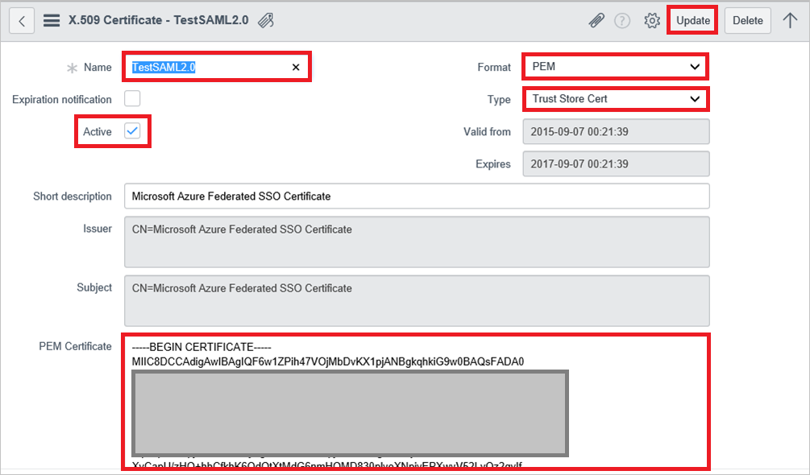
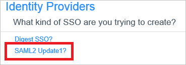
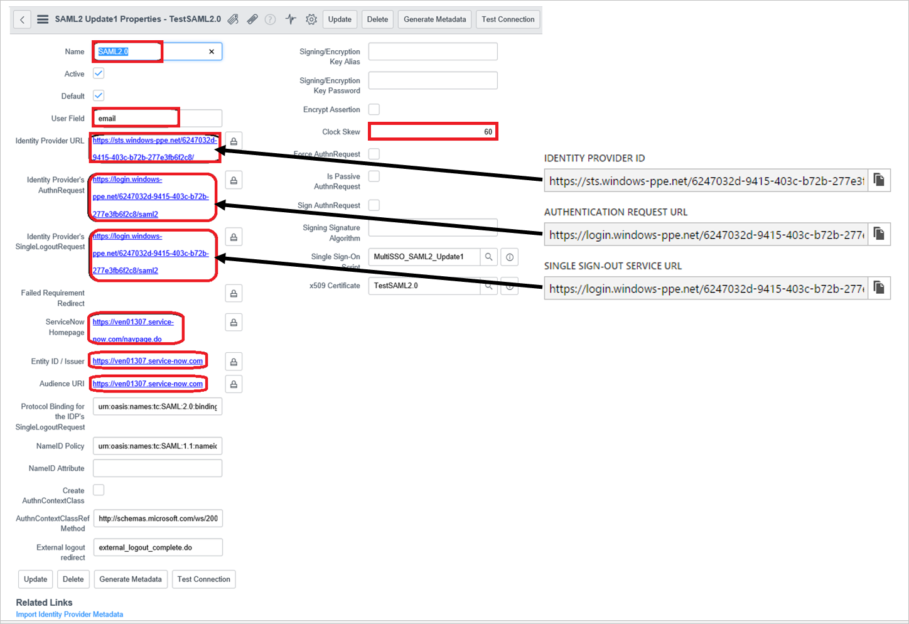

## Prerequisites
To configure Azure AD integration with ServiceNow and ServiceNow Express, you need the following items:

* An Azure AD subscription
* For ServiceNow, an instance or tenant of ServiceNow, Calgary version or higher
* For ServiceNow Express, an instance of ServiceNow Express, Helsinki version or higher
* The ServiceNow tenant must have the [Multiple Provider Single Sign On Plugin](http://wiki.servicenow.com/index.php?title=Multiple_Provider_Single_Sign-On#gsc.tab=0) enabled. This can be done by [submitting a service request](https://hi.service-now.com). 

To test the steps in this tutorial, you should follow these recommendations:

* You should not use your production environment, unless this is necessary.
* If you don't have an Azure AD trial environment, you can get a one-month trial [here](https://azure.microsoft.com/pricing/free-trial/).

## Configuring and testing Azure AD single sign-on
For single sign-on to work, Azure AD needs to know what the counterpart user in ServiceNow is to a user in Azure AD. In other words, a link relationship between an Azure AD user and the related user in ServiceNow needs to be established.
This link relationship is established by assigning the value of the **user name** in Azure AD as the value of the **Username** in ServiceNow. 

### Configuring Azure AD Single Sign-On for ServiceNow
1. Sign-on to your ServiceNow application as an administrator. (Example: https://YOUR_TENANT.service-now.com).

2. Activate the *Integration - Multiple Provider Single Sign-On Installer* plugin by following the next steps:
   
    a. In the navigation pane on the left side, go to **System Definition** section and then click **Plugins**.
   
    
   
    b. Search for *Integration - Multiple Provider Single Sign-On Installer*.
   
    
   
    c. Select the plugin. Rigth click and select **Activate/Upgrade**.
   
    d. Click the **Activate** button.

3. In the navigation pane on the left side, click **Properties**.  
   
    

4. On the **Multiple Provider SSO Properties** dialog, perform the following steps:
   
    
   
    a. As **Enable multiple provider SSO**, select **Yes**.
   
    b. As **Enable debug logging got the multiple provider SSO integration**, select **Yes**.
   
    c. In **The field on the user table that...** textbox, type **user_name**.
   
    d. Click **Save**.

5. In the navigation pane on the left side, click **x509 Certificates**.
    
     

6. On the **X.509 Certificates** dialog, click **New**.
    
     

7. On the **X.509 Certificates** dialog, perform the following steps:
    
     
    
     a. Click **New**.
    
     b. In the **Name** textbox, type a name for your configuration (e.g.: **TestSAML2.0**).
    
     c. Select **Active**.
    
     d. As **Format**, select **PEM**.
    
     e. As **Type**, select **Trust Store Cert**.
    
     f. Download the following Base64-encoded certificate in notepad, copy the content of it into your clipboard, and then paste it to the **PEM Certificate** textbox: [Certificate download](%metadata:CertificateDownloadBase64Url%)
    
     g. Click **Update**.

8. In the navigation pane on the left side, click **Identity Providers**.
    
     

9. On the **Identity Providers** dialog, click **New**:
    
     

10. On the **Identity Providers** dialog, click **SAML2 Update1?**:
    
     

11. On the SAML2 Update1 Properties dialog, perform the following steps:
    
     

    a. in the **Name** textbox, type a name for your configuration (e.g.: **SAML 2.0**).

    b. In the **User Field** textbox, type **email** or **user_id**, depending on which field is used to uniquely identify users in your ServiceNow deployment. 

    > Note: You can configue Azure AD to emit either the Azure AD user ID (user principal name) or the email address as the unique identifier in the SAML token by going to the **User Attributes** section of the app configuration blade and mapping the desired field to the **nameidentifier** attribute. The value stored for the selected attribute in Azure AD (e.g. user principal name) must match the value stored in ServiceNow for the entered field (e.g. user_id)

    c. Copy the following value, and then paste it into the **Identity Provider URL** textbox: %metadata:IssuerUri%

    d. Copy the following value, and then paste it into the **Identity Provider's AuthnRequest** textbox:  %metadata:SingleSignOnServiceUrl%

    e. Copy the following value, and then paste it into the **Identity Provider's SingleLogoutRequest** textbox:  %metadata:SingleSignOutServiceUrl%

    f. In the **ServiceNow Homepage** textbox, type the URL of your ServiceNow instance homepage.

    > 
    > Note: The ServiceNow instance homepage is a concatenation of your **ServieNow tenant URL** and **/navpage.do** (e.g.:`https://fabrikam.service-now.com/navpage.do`).

    g. In the **Entity ID / Issuer** textbox, type the URL of your ServiceNow tenant.

    h. In the **Audience URL** textbox, type the URL of your ServiceNow tenant. 

    i. In the **Protocol Binding for the IDP's SingleLogoutRequest** textbox, type **urn:oasis:names:tc:SAML:2.0:bindings:HTTP-Redirect**.

    j. In the NameID Policy textbox, type **urn:oasis:names:tc:SAML:1.1:nameid-format:unspecified**.

    k. Deselect **Create an AuthnContextClass**.

    l. In the **AuthnContextClassRef Method**, type `http://schemas.microsoft.com/ws/2008/06/identity/authenticationmethod/password`. This is only needed if you are cloud only organization. If you are using on premise ADFS or MFA for authentication then you should not configure this value. 

    m. In **Clock Skew** textbox, type **60**.

    n. As **Single Sign On Script**, select **MultiSSO_SAML2_Update1**.

    o. As **x509 Certificate**, select the certificate you have created in the previous step.

    p. Click **Submit**. 

### Configuring Azure AD Single Sign-On for ServiceNow Express
1. Sign-on to your ServiceNow Express application as an administrator.

2. In the navigation pane on the left side, click **Single Sign-On**.  
   
    

3. On the **Single Sign-On** dialog, click the configuration icon on the upper right and set the following properties:
   
    
   
    a. Toggle **Enable multiple provider SSO** to the right.
   
    b. Toggle **Enable debug logging for the multiple provider SSO integration** to the right.
   
    c. In **The field on the user table that...** textbox, type **user_name**.
4. On the **Single Sign-On** dialog, click **Add New Certificate**.
   
    
5. On the **X.509 Certificates** dialog, perform the following steps:
    
    
    
    a. In the **Name** textbox, type a name for your configuration (e.g.: **TestSAML2.0**).
    
    b. Select **Active**.
    
    c. As **Format**, select **PEM**.
    
    d. As **Type**, select **Trust Store Cert**.
    
    e. Create a Base64 encoded file from your downloaded certificate.
    
    > 
    > Note: For more details, see [How to convert a binary certificate into a text file](http://youtu.be/PlgrzUZ-Y1o).
    > 
    > 
    
    f. Download the following Base64-encoded certificate in notepad, copy the content of it into your clipboard, and then paste it to the **PEM Certificate** textbox: [Certificate download](%metadata:CertificateDownloadBase64Url%)
    
    g. Click **Update**.
6. On the **Single Sign-On** dialog, click **Add New IdP**.
    
    
7. On the **Add New Identity Provider** dialog, under **Configure Identity Provider**, perform the following steps:
    
    

    a. In the **Name** textbox, type a name for your configuration (e.g.: **SAML 2.0**).

    b. Copy the following value, and then paste it into the **Identity Provider URL** textbox: %metadata:IssuerUri%

    c. Copy the following value, and then paste it into the **Identity Provider's AuthnRequest** textbox:  %metadata:SingleSignOnServiceUrl%

    d. Copy the following value, and then paste it into the **Identity Provider's SingleLogoutRequest** textbox:  %metadata:SingleSignOutServiceUrl%

    e. As **Identity Provider Certificate**, select the certificate you have created in the previous step.

8. Click **Advanced Settings**, and under **Additional Identity Provider Properties**, perform the following steps:
   
    
   
    a. In the **Protocol Binding for the IDP's SingleLogoutRequest** textbox, type **urn:oasis:names:tc:SAML:2.0:bindings:HTTP-Redirect**.
   
    b. In the **NameID Policy** textbox, type **urn:oasis:names:tc:SAML:1.1:nameid-format:unspecified**.    
   
    c. In the **AuthnContextClassRef Method**, type **http://schemas.microsoft.com/ws/2008/06/identity/authenticationmethod/password**.
   
    d. Deselect **Create an AuthnContextClass**.

9. Under **Additional Service Provider Properties**, perform the following steps:
   
    
   
    a. In the **ServiceNow Homepage** textbox, type the URL of your ServiceNow instance homepage.

    Note: The ServiceNow instance homepage is a concatenation of your **ServieNow tenant URL** and **/navpage.do** (e.g.: https://fabrikam.service-now.com/navpage.do).
   
    b. In the **Entity ID / Issuer** textbox, type the URL of your ServiceNow tenant.
   
    c. In the **Audience URI** textbox, type the URL of your ServiceNow tenant. 
   
    d. In **Clock Skew** textbox, type **60**.
   
    e. In the **User Field** textbox, type **email** or **user_id**, depending on which field is used to uniquely identify users in your ServiceNow deployment.
   
   Note: You can configue Azure AD to emit either the Azure AD user ID (user principal name) or the email address as the unique identifier in the SAML token by going to the **User Attributes** section of the app configuration blade and mapping the desired field to the **nameidentifier** attribute. The value stored for the selected attribute in Azure AD (e.g. user principal name) must match the value stored in ServiceNow for the entered field (e.g. user_id)
   
    f. Click **Save**. 

