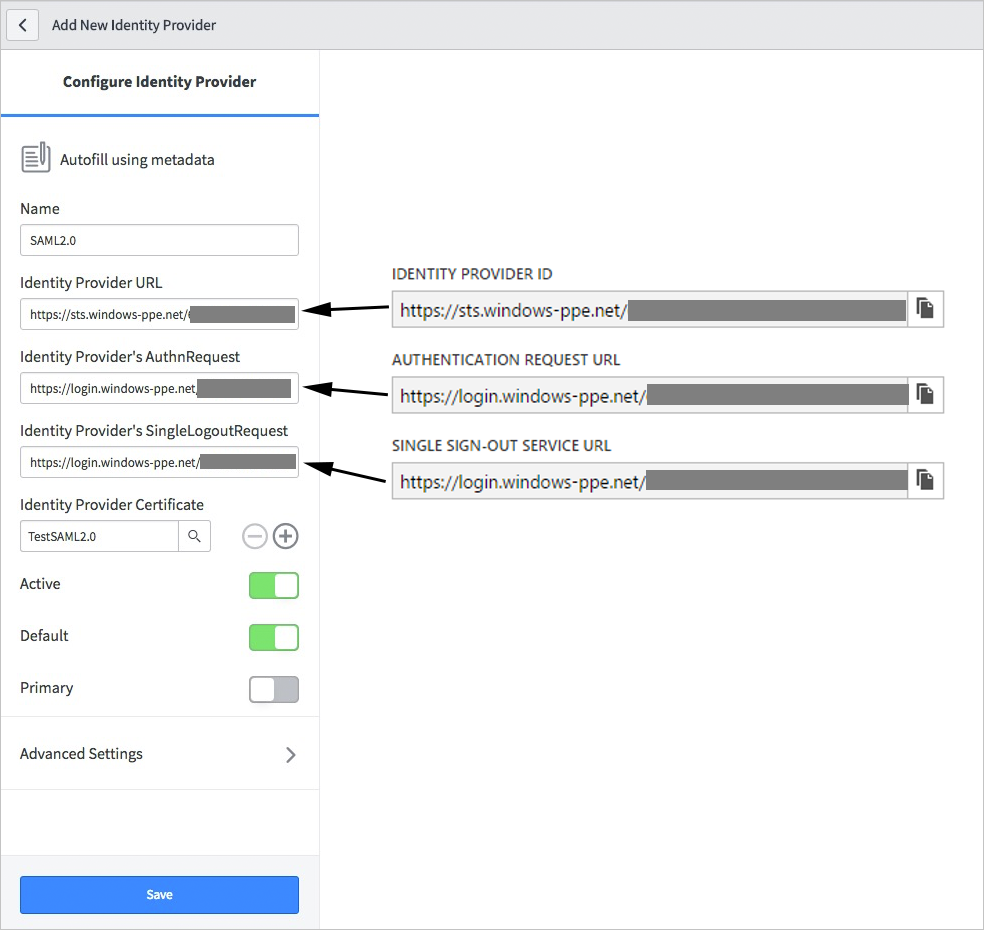
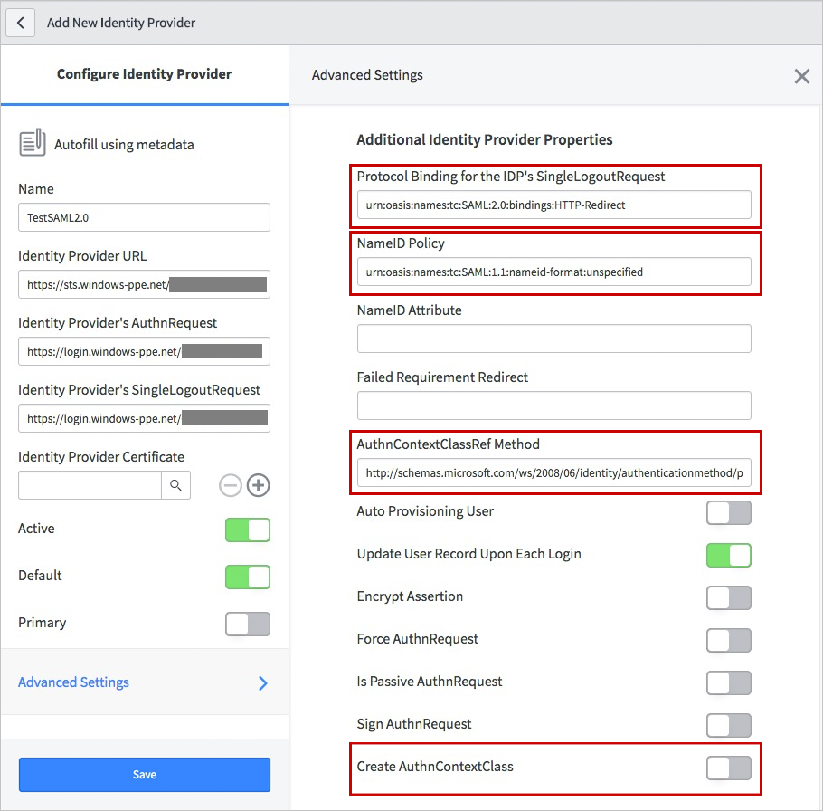

## Prerequisites

To configure Azure AD integration with ServiceNow, you need the following items:

- An Azure AD subscription
- A ServiceNow single-sign on enabled subscription

> **Note:**
> To test the steps in this tutorial, we do not recommend using a production environment.

To test the steps in this tutorial, you should follow these recommendations:

- Do not use your production environment, unless it is necessary.
- If you don't have an Azure AD trial environment, you can get a one-month trial [here](https://azure.microsoft.com/pricing/free-trial/).

### Configuring ServiceNow for single sign-on

1. Sign on to your ServiceNow application as an administrator.

2. Activate the *Integration - Multiple Provider Single Sign-On Installer* plugin by following the next steps:
   
    a. In the navigation pane on the left side, go to **System Definition** section and then click **Plugins**.
   
    
   
    b. Search for *Integration - Multiple Provider Single Sign-On Installer*.
   
    
   
    c. Select the plugin. Right click and select **Activate/Upgrade**.
   
    d. Click the **Activate** button.

3. In the navigation pane on the left side, click **Properties**.  
   
    

4. On the **Multiple Provider SSO Properties** dialog, perform the following steps:
   
    
   
    a. As **Enable multiple provider SSO**, select **Yes**.
   
    b. As **Enable debug logging got the multiple provider SSO integration**, select **Yes**.
   
    c. In **The field on the user table that...** textbox, type **user_name**.
   
    d. Click **Save**.

5. In the navigation pane on the left side, click **x509 Certificates**.
    
     

6. On the **X.509 Certificates** dialog, click **New**.
    
     

7. On the **X.509 Certificates** dialog, perform the following steps:
    
     
    
     a. In the **Name** textbox, type a name for your configuration (for example: **TestSAML2.0**).
    
     b. Select **Active**.
    
     c. As **Format**, select **PEM**.
    
     d. As **Type**, select **Trust Store Cert**.
    
     e. Open your Base64 encoded certificate in notepad, copy the content of it into your clipboard, and then paste it to the **PEM Certificate** textbox.
    
     f. Click **Update**.

8. In the navigation pane on the left side, click **Identity Providers**.
    
     

9. On the **Identity Providers** dialog, click **New**:
    
     

10. On the **Identity Providers** dialog, click **SAML2 Update1?**
    
     

11. On the SAML2 Update1 Properties dialog, perform the following steps:
    
     

    a. In the **Name** textbox, type a name for your configuration (for example, **SAML 2.0**).

    b. In the **User Field** textbox, type **email** or **user_name**, depending on which field is used to uniquely identify users in your ServiceNow deployment. 

    > [!NOTE] 
    > You can configure Azure AD to emit either the Azure AD user ID (user principal name) or the email address as the unique identifier in the SAML token by going to the **ServiceNow > Attributes > Single Sign-On** section of the Azure portal and mapping the desired field to the **nameidentifier** attribute. The value stored for the selected attribute in Azure AD (for example, user principal name) must match the value stored in ServiceNow for the entered field (for example, user_name)

    c. In the Azure AD  portal, copy the **Azure AD SAML Entity ID** : %metadata:IssuerUri% value, and then paste it into the **Identity Provider URL** textbox.

    d. In the Azure AD  portal, copy the **Azure AD Single Sign-On Service URL** : %metadata:singleSignOnServiceUrl% value, and then paste it into the **Identity Provider's AuthnRequest** textbox.

    e. In the Azure AD  portal, copy the **Azure AD Sign Out URL** : %metadata:singleSignOutServiceUrl% value, and then paste it into the **Identity Provider's SingleLogoutRequest** textbox.

    f. In the **ServiceNow Homepage** textbox, type the URL of your ServiceNow instance homepage.

    > [!NOTE] 
    > The ServiceNow instance homepage is a concatenation of your **ServieNow tenant URL** and **/navpage.do** (for example:`https://fabrikam.service-now.com/navpage.do`).

    g. In the **Entity ID / Issuer** textbox, type the URL of your ServiceNow tenant.

    h. In the **Audience URL** textbox, type the URL of your ServiceNow tenant. 

    i. In the **Protocol Binding for the IDP's SingleLogoutRequest** textbox, type **urn:oasis:names:tc:SAML:2.0:bindings:HTTP-Redirect**.

    j. In the NameID Policy textbox, type **urn:oasis:names:tc:SAML:1.1:nameid-format:unspecified**.

    k. Deselect **Create an AuthnContextClass**.

    l. In the **AuthnContextClassRef Method**, type `http://schemas.microsoft.com/ws/2008/06/identity/authenticationmethod/password`. This is only needed if you are cloud only organization. If you are using on-premise ADFS or MFA for authentication, then you should not configure this value. 

    m. In **Clock Skew** textbox, type **60**.

    n. As **Single Sign On Script**, select **MultiSSO_SAML2_Update1**.

    o. As **x509 Certificate**, select the certificate you have created in the previous step.

    p. Click **Submit**. 

### Configuring ServiceNow Express for single sign-on 

1. Sign on to your ServiceNow Express application as an administrator.

2. In the navigation pane on the left side, click **Single Sign-On**.  
   
    

3. On the **Single Sign-On** dialog, click the configuration icon on the upper right and set the following properties:
   
    
   
    a. Toggle **Enable multiple provider SSO** to the right.
   
    b. Toggle **Enable debug logging for the multiple provider SSO integration** to the right.
   
    c. In **The field on the user table that...** textbox, type **user_name**.

4. On the **Single Sign-On** dialog, click **Add New Certificate**.
   
    

5. On the **X.509 Certificates** dialog, perform the following steps:
    
    
    
    a. In the **Name** textbox, type a name for your configuration (for example: **TestSAML2.0**).
    
    b. Select **Active**.
    
    c. As **Format**, select **PEM**.
    
    d. As **Type**, select **Trust Store Cert**.
    
    e. Open your **[Azure AD Signing Certifcate (Base64 encoded)](%metadata:certificateDownloadBase64Url%)** downloaded from Azure portal in notepad, copy the content of it into your clipboard, and then paste it to the **PEM Certificate** textbox.
    
    f. Click **Update**.

6. On the **Single Sign-On** dialog, click **Add New IdP**.
    
    

7. On the **Add New Identity Provider** dialog, under **Configure Identity Provider**, perform the following steps:
    
    

    a. In the **Name** textbox, type a name for your configuration (for example: **SAML 2.0**).

    b. In the Azure AD  portal, copy the **Azure AD SAML Entity ID** : %metadata:IssuerUri% value, and then paste it into the **Identity Provider URL** textbox.

    c. In the Azure AD  portal, copy the **Azure AD Single Sign-On Service URL** : %metadata:singleSignOnServiceUrl% value, and then paste it into the **Identity Provider's AuthnRequest** textbox.

    d. In the Azure AD portal, copy the **Azure AD Sign Out URL** : %metadata:singleSignOutServiceUrl% value, and then paste it into the **Identity Provider's SingleLogoutRequest** textbox.

    e. As **Identity Provider Certificate**, select the certificate you have created in the previous step.

8. Click **Advanced Settings**, and under **Additional Identity Provider Properties**, perform the following steps:
   
    
   
    a. In the **Protocol Binding for the IDP's SingleLogoutRequest** textbox, type **urn:oasis:names:tc:SAML:2.0:bindings:HTTP-Redirect**.
   
    b. In the **NameID Policy** textbox, type **urn:oasis:names:tc:SAML:1.1:nameid-format:unspecified**.    
   
    c. In the **AuthnContextClassRef Method**, type `http://schemas.microsoft.com/ws/2008/06/identity/authenticationmethod/password`.
   
    d. Deselect **Create an AuthnContextClass**.

9. Under **Additional Service Provider Properties**, perform the following steps:
   
    
   
    a. In the **ServiceNow Homepage** textbox, type the URL of your ServiceNow instance homepage.
   
    > [!NOTE]
    > The ServiceNow instance homepage is a concatenation of your **ServieNow tenant URL** and **/navpage.do** (for example: `https://fabrikam.service-now.com/navpage.do`).
   
    b. In the **Entity ID / Issuer** textbox, type the URL of your ServiceNow tenant.
   
    c. In the **Audience URI** textbox, type the URL of your ServiceNow tenant. 
   
    d. In **Clock Skew** textbox, type **60**.
   
    e. In the **User Field** textbox, type **email** or **user_name**, depending on which field is used to uniquely identify users in your ServiceNow deployment.
   
    > [!NOTE]
    > You can configure Azure AD to emit either the Azure AD user ID (user principal name) or the email address as the unique identifier in the SAML token by going to the **ServiceNow > Attributes > Single Sign-On** section of the Azure portal and mapping the desired field to the **nameidentifier** attribute. The value stored for the selected attribute in Azure AD (for example, user principal name) must match the value stored in ServiceNow for the entered field (for example, user_name)

    f. Click **Save**. 

## Quick Reference

* **Azure AD Single Sign-On Service URL** : %metadata:singleSignOnServiceUrl%

* **Azure AD Sign Out URL** : %metadata:singleSignOutServiceUrl%

* **Azure AD SAML Entity ID** : %metadata:IssuerUri%

* **[Download Azure AD Signing Certifcate (Base64 encoded)](%metadata:certificateDownloadBase64Url%)**

## Additional Resources

* [How to integrate servicenow with Azure Active Directory](active-directory-saas-servicenow-tutorial.md)
