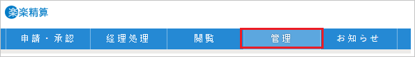
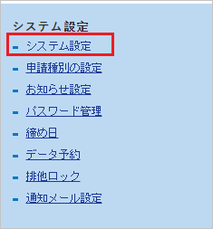
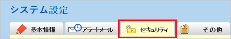
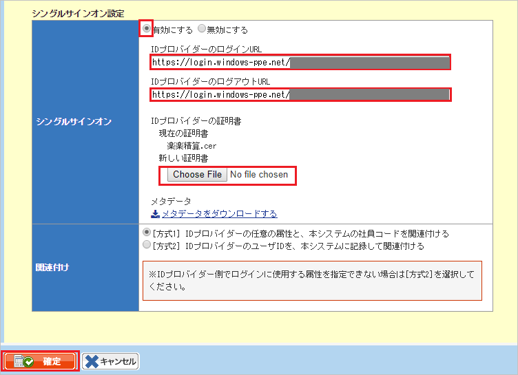

## Prerequisites

To configure Azure AD integration with Settling music, you need the following items:

- An Azure AD subscription
- A Settling music single sign-on enabled subscription

> **Note:**
> To test the steps in this tutorial, we do not recommend using a production environment.

To test the steps in this tutorial, you should follow these recommendations:

- Do not use your production environment, unless it is necessary.
- If you don't have an Azure AD trial environment, you can [get a one-month trial](https://azure.microsoft.com/pricing/free-trial/).

### Configuring Settling music for single sign-on

1. In a different web browser window, login to Settling music as a Security Administrator.

2. On top of the page, click **management** tab.

	

3. Click on  **System setting** tab.

	

4. Switch to **Security** tab.

	

5. On the **Single sign-on setting** section, perform the following steps:

	

	a. Click **To enable**.

	b. In the **Login URL of the ID provider** textbox, paste the value of **Azure AD Single Sign-On Service URL** : %metadata:singleSignOnServiceUrl% which you have copied from Azure portal.

	c. In the **ID provider logout URL** textbox, paste the value of **Azure AD Sign Out URL** : %metadata:singleSignOutServiceUrl% which you have copied from Azure portal.

	d. Click **Choose File** to upload the **[Downloaded Azure AD Signing Certifcate (Base64 encoded)](%metadata:certificateDownloadBase64Url%)** which you have downloaded form Azure portal.

	e. Click the **Save** button.

## Quick Reference

* **Azure AD Single Sign-On Service URL** : %metadata:singleSignOnServiceUrl%

* **Azure AD Sign Out URL** : %metadata:singleSignOutServiceUrl%

* **Azure AD SAML Entity ID** : %metadata:IssuerUri%

* **[Download Azure AD Signing Certifcate (Base64 encoded)](%metadata:certificateDownloadBase64Url%)**

## Additional Resources

* [How to integrate Settling music with Azure Active Directory](https://docs.microsoft.com/azure/active-directory/active-directory-saas-settlingmusic-tutorial)
