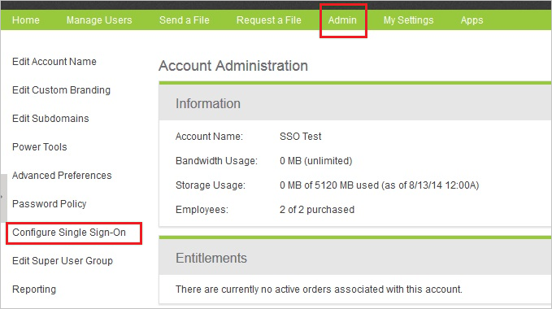
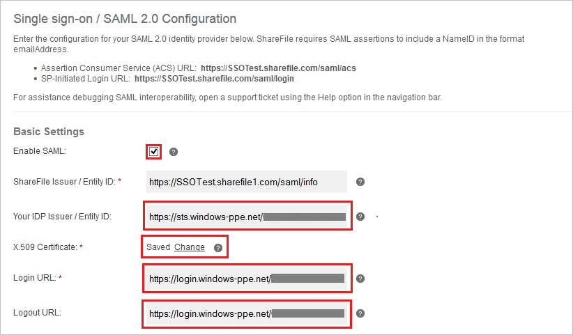

## Prerequisites

To configure Azure AD integration with Citrix ShareFile, you need the following items:

- An Azure AD subscription
- A Citrix ShareFile single sign-on enabled subscription

> **Note:**
> To test the steps in this tutorial, we do not recommend using a production environment.

To test the steps in this tutorial, you should follow these recommendations:

- Do not use your production environment, unless it is necessary.
- If you don't have an Azure AD trial environment, you can [get a one-month trial](https://azure.microsoft.com/pricing/free-trial/).

### Configuring Citrix ShareFile for single sign-on

1. In a different web browser window, log into your **Citrix ShareFile** company site as an administrator.

2. In the toolbar on the top, click **Admin**.

3. In the left navigation pane, select **Configure Single Sign-On**.
   
    

4. On the **Single Sign-On/ SAML 2.0 Configuration** dialog page under **Basic Settings**, perform the following steps:
   
    
   
	a. Click **Enable SAML**.
	
	b. In **Your IDP Issuer/ Entity ID** textbox, paste the value of **Azure AD SAML Entity ID** : %metadata:IssuerUri% which you have copied from Azure portal.

	c. Click **Change** next to the **X.509 Certificate** field and then upload the **[Downloaded Azure AD Signing Certificate (Base64 encoded)](%metadata:certificateDownloadBase64Url%)** from the Azure portal.
	
	d. In **Login URL** textbox, paste the value of **Azure AD Single Sign-On Service URL** : %metadata:singleSignOnServiceUrl% which you have copied from Azure portal.
	
	e. In **Logout URL** textbox, paste the value of **Azure AD Sign Out URL** : %metadata:singleSignOutServiceUrl% which you have copied from Azure portal.

5. Click **Save** on the Citrix ShareFile management portal.

## Quick Reference

* **Azure AD Single Sign-On Service URL** : %metadata:singleSignOnServiceUrl%

* **Azure AD Sign Out URL** : %metadata:singleSignOutServiceUrl%

* **Azure AD SAML Entity ID** : %metadata:IssuerUri%

* **[Download Azure AD Signing Certificate (Base64 encoded)](%metadata:certificateDownloadBase64Url%)**

## Additional Resources

* [How to integrate Citrix ShareFile with Azure Active Directory](https://docs.microsoft.com/azure/active-directory/active-directory-saas-sharefile-tutorial)
