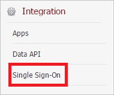
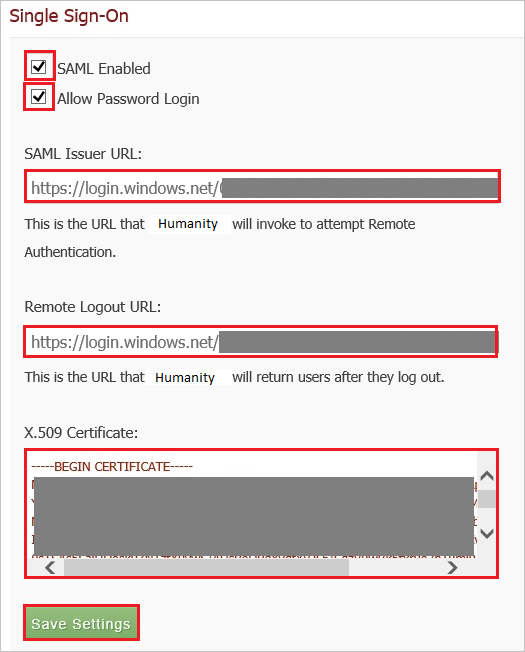

## Prerequisites

To configure Azure AD integration with Humanity, you need the following items:

- An Azure AD subscription
- A Humanity single sign-on enabled subscription

> **Note:**
> To test the steps in this tutorial, we do not recommend using a production environment.

To test the steps in this tutorial, you should follow these recommendations:

- Do not use your production environment, unless it is necessary.
- If you don't have an Azure AD trial environment, you can get a one-month trial [here](https://azure.microsoft.com/pricing/free-trial/).

### Configuring Humanity for single sign-on

1. In a different web browser window, log in to your **Humanity** company site as an administrator.

2. In the menu on the top, click **Admin**.
   
    

3. Under **Integration**, click **Single Sign-On**.
   
    

4. In the **Single Sign-On** section, perform the following steps:
   
    
   
    a. Select **SAML Enabled**.

    b. Select **Allow Password Login**.

    c. Paste the **Azure AD Single Sign-On Service URL** : %metadata:singleSignOnServiceUrl% value into the **SAML Issuer URL** textbox.

    d. Paste the **Azure AD Sign Out URL** : %metadata:singleSignOutServiceUrl% value into the **Remote Logout URL** textbox.
   
    e. Open your **[Downloaded Azure AD Signing Certifcate (Base64 encoded)](%metadata:certificateDownloadBase64Url%)** in notepad, copy the content of it into your clipboard, and then paste it to the **X.509 Certificate** textbox.

5. Click **Save Settings**.

## Quick Reference

* **Azure AD Single Sign-On Service URL** : %metadata:singleSignOnServiceUrl%

* **Azure AD Sign Out URL** : %metadata:singleSignOutServiceUrl%

* **[Download Azure AD Signing Certifcate (Base64 encoded)](%metadata:certificateDownloadBase64Url%)**

## Additional Resources

* [How to integrate Humanity with Azure Active Directory](https://docs.microsoft.com/azure/active-directory/active-directory-saas-shiftplanning-tutorial)
