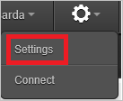
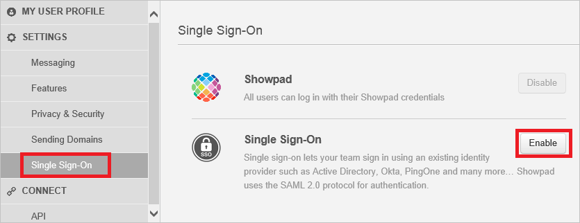
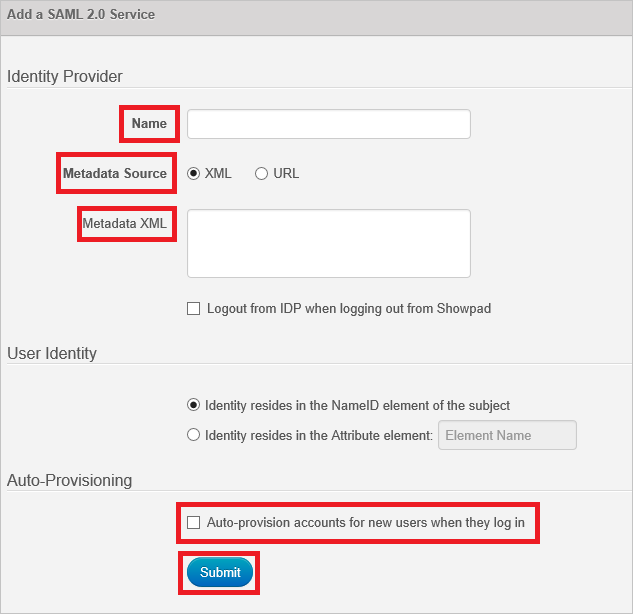

## Prerequisites

To configure Azure AD integration with showpad, you need the following items:

- An Azure AD subscription
- A showpad single sign-on enabled subscription

> **Note:**
> To test the steps in this tutorial, we do not recommend using a production environment.

To test the steps in this tutorial, you should follow these recommendations:

- Do not use your production environment, unless it is necessary.
- If you don't have an Azure AD trial environment, you can get a one-month trial [here](https://azure.microsoft.com/pricing/free-trial/).

### Configuring showpad for single sign-on

1. Sign-on to your Showpad tenant as an administrator.

2. In the menu on the top, click the **Settings**.
   
     

3. Navigate to "**Single Sign-On**" and click "**Enable**."
   
    

4. On the **Add a SAML 2.0 Service** dialog, perform the following steps:
   
     
   
    a. In the **Name** textbox, type the name of Identifier Provider (for example: your company name).
   
    b. As **Metadata Source**, select **XML**.
   
    c. Copy the content of metadata XML file, which you have downloaded from the Azure portal, and then paste it into the **Metadata XML** textbox.
   
    d. Select **Auto-provision accounts for new users when they log in**.
   
    e. Click **Submit**.

## Quick Reference

* **[Download Azure AD Signing Certifcate](%metadata:CertificateDownloadRawUrl%)**

* **[Download SAML Metadata file](%metadata:metadataDownloadUrl%)**

## Additional Resources

* [How to integrate showpad with Azure Active Directory](https://docs.microsoft.com/azure/active-directory/active-directory-saas-showpad-tutorial)
