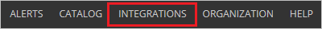
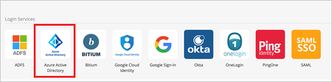
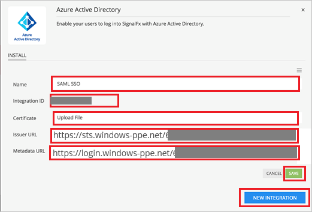

## Prerequisites

To configure Azure AD integration with SignalFx, you need the following items:

- An Azure AD subscription
- A SignalFx single sign-on enabled subscription

> **Note:**
> To test the steps in this tutorial, we do not recommend using a production environment.

To test the steps in this tutorial, you should follow these recommendations:

- Do not use your production environment, unless it is necessary.
- If you don't have an Azure AD trial environment, you can [get a one-month trial](https://azure.microsoft.com/pricing/free-trial/).

### Configuring SignalFx for single sign-on

1. Sign-on to your SignalFx company site as administrator.

2. In SignalFx, on the top click **Integrations** to open the Integrations page.

	

3. Click on **Azure Active Directory** tile under **Login Services** section.
 
	

4. Click on **NEW INTEGRATION** and under the **INSTALL** tab perform the following steps:
 
	

	a. In the **Name** textbox type, a new integration name, like **OurOrgName SAML SSO**.

	b. Copy the **Integration ID** value and append with the **Reply URL** like `https://api.signalfx.com/v1/saml/acs/<integration ID>` in the **Reply URL** textbox of **SignalFx Domain and URLs** section in Azure portal.

	c. Click on **Upload File** to upload the **[Downloaded Azure AD Signing Certifcate (Base64 encoded)](%metadata:certificateDownloadBase64Url%)** from Azure portal in the **Certificate** textbox.

	d. In the **Issuer URL** textbox, paste the value of **Azure AD SAML Entity ID** : %metadata:IssuerUri%, which you have copied from the Azure portal.

	e. In the **Metadata URL** textbox, paste the **Metadata url** pattern which you have generated from the Azure portal.

	f. Click **Save**.

## Quick Reference

* **Azure AD SAML Entity ID** : %metadata:IssuerUri%

* **[Download Azure AD Signing Certifcate (Base64 encoded)](%metadata:certificateDownloadBase64Url%)**

## Additional Resources

* [How to integrate SignalFx with Azure Active Directory](https://docs.microsoft.com/azure/active-directory/active-directory-saas-signalfx-tutorial)
