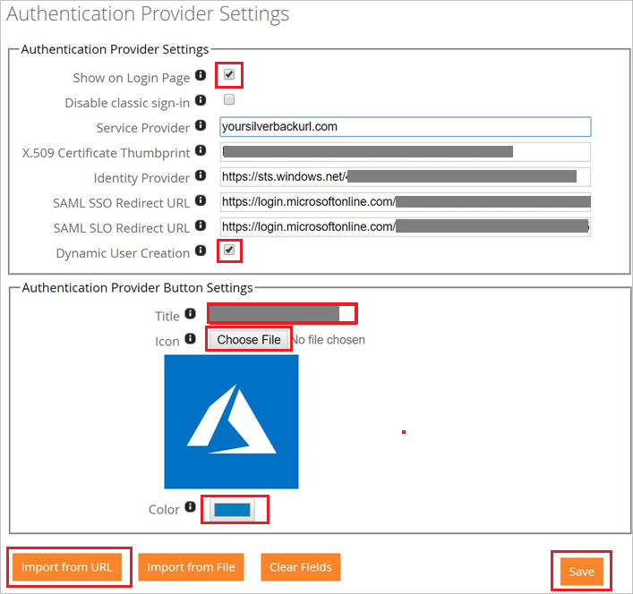

## Prerequisites

To configure Azure AD integration with Silverback, you need the following items:

- An Azure AD subscription
- A Silverback single sign-on enabled subscription

> **Note:**
> To test the steps in this tutorial, we do not recommend using a production environment.

To test the steps in this tutorial, you should follow these recommendations:

- Do not use your production environment, unless it is necessary.
- If you don't have an Azure AD trial environment, you can [get a one-month trial](https://azure.microsoft.com/pricing/free-trial/).

### Configuring Silverback for single sign-on

1. Login to your Silverback Server as an Administrator and perform the following steps:

	a. 	Navigate to **Admin** > **Authentication Provider**.

	b. On the **Authentication Provider Settings** page, perform the following steps:

	

	c. 	Click on **Import from URL**.
 	
	d.	Paste the copied Metadata URL and click **OK**.
	
	e.	Confirm with **OK** then the values will be populated automatically.
	
	f.	Enable **Show on Login Page**.
	
	g.	Enable **Dynamic User Creation** if you want to add by Azure AD authorized users automatically (optional).
	
	h.	Create a **Title** for the button on the Self Service Portal.

	i.	Upload an **Icon** by clicking on **Choose File**.
	
	j.	Select the background **color** for the button.
	
	k.	Click **Save**.

## Quick Reference

* **Azure AD Single Sign-On Service URL** : %metadata:singleSignOnServiceUrl%

* **[Download Azure AD Signing Certifcate](%metadata:CertificateDownloadRawUrl%)**

* **[Download SAML Metadata file](%metadata:metadataDownloadUrl%)**

## Additional Resources

* [How to integrate Silverback with Azure Active Directory](https://docs.microsoft.com/azure/active-directory/saas-apps/silverback-tutorial)
