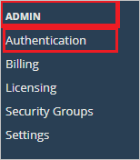
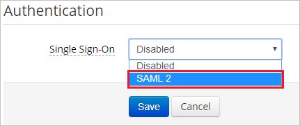
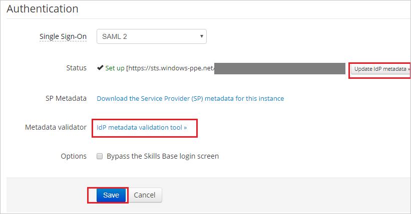

## Prerequisites

To configure Azure AD integration with Skills Base, you need the following items:

- An Azure AD subscription
- A Skills Base single sign-on enabled subscription

> **Note:**
> To test the steps in this tutorial, we do not recommend using a production environment.

To test the steps in this tutorial, you should follow these recommendations:

- Do not use your production environment, unless it is necessary.
- If you don't have an Azure AD trial environment, you can [get a one-month trial](https://azure.microsoft.com/pricing/free-trial/).

### Configuring Skills Base for single sign-on

1. In a different web browser window, login to Skills Base as a Security Administrator.

2. From the left side of menu, under **ADMIN** click **Authentication**.

	

3. On the **Authentication** Page, select Single Sign-On as **SAML 2**.

	

4. On the **Authentication** Page, Perform the following steps:

	

	a. Click on **Update IdP metadata** button next to **Status** option and paste the contents of **[Downloaded SAML Metadata file](%metadata:metadataDownloadUrl%)** from the Azure portal in the specified textbox.

	> **Note:**
	> You can also validate **[Downloaded SAML Metadata file](%metadata:metadataDownloadUrl%)** through the **Metadata validator** tool as highlighted in screenshot above.

	b. Click **Save**.

## Quick Reference

* **Azure AD Single Sign-On Service URL** : %metadata:singleSignOnServiceUrl%

* **[Download SAML Metadata file](%metadata:metadataDownloadUrl%)**

## Additional Resources

* [How to integrate Skills Base with Azure Active Directory](https://docs.microsoft.com/azure/active-directory/saas-apps/skillsbase-tutorial)
