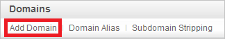
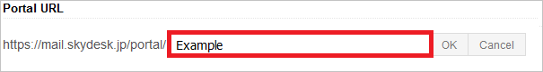

## Prerequisites

To configure Azure AD integration with SkyDesk Email, you need the following items:

- An Azure AD subscription
- A SkyDesk Email single sign-on enabled subscription

> **Note:**
> To test the steps in this tutorial, we do not recommend using a production environment.

To test the steps in this tutorial, you should follow these recommendations:

- Do not use your production environment, unless it is necessary.
- If you don't have an Azure AD trial environment, you can get a one-month trial here: [Trial offer](https://azure.microsoft.com/pricing/free-trial/).

### Configuring SkyDesk Email for single sign-on

1. To enable SSO in **SkyDesk Email**, perform the following steps:

    a. Sign-on to your SkyDesk Email account as administrator.

    b. In the menu on the top, click **Setup**, and select **Org**. 
    
      
  
    c. Click on **Domains** from the left panel.
    
      

    d. Click on **Add Domain**.
    
      

    e. Enter your Domain name, and then verify the Domain.
    
      

    f. Click on **SAML Authentication** from the left panel.
    
      

2. On the **SAML Authentication** dialog page, perform the following steps:
   
      
   
    >[!NOTE]
    >To use SAML based authentication, you should either have **verified domain** or **portal URL** setup. You can set the portal URL with the unique name.
    > 
    > 
   
    

    a. In the **Login URL** textbox, paste the value of **Azure AD Single Sign-On Service URL** : %metadata:singleSignOnServiceUrl%, which you have copied from Azure portal.
   
    b. In the **Logout** URL textbox, paste the value of **Azure AD Sign Out URL** : %metadata:singleSignOutServiceUrl%, which you have copied from Azure portal.

    c. **Change Password URL** is optional so leave it blank.

    d. Click on **Get Key From File** to select your **[Downloaded Azure AD Signing Certifcate (Base64 encoded)](%metadata:certificateDownloadBase64Url%)** from Azure portal, and then click **Open** to upload the certificate.

    e. As **Algorithm**, select **RSA**.

    f. Click **Ok** to save the changes.

## Quick Reference

* **Azure AD Single Sign-On Service URL** : %metadata:singleSignOnServiceUrl%

* **Azure AD Sign Out URL** : %metadata:singleSignOutServiceUrl%

* **Azure AD SAML Entity ID** : %metadata:IssuerUri%

* **[Download Azure AD Signing Certifcate (Base64 encoded)](%metadata:certificateDownloadBase64Url%)**

## Additional Resources

* [How to integrate SkyDesk Email with Azure Active Directory](https://docs.microsoft.com/azure/active-directory/active-directory-saas-skydeskemail-tutorial)
