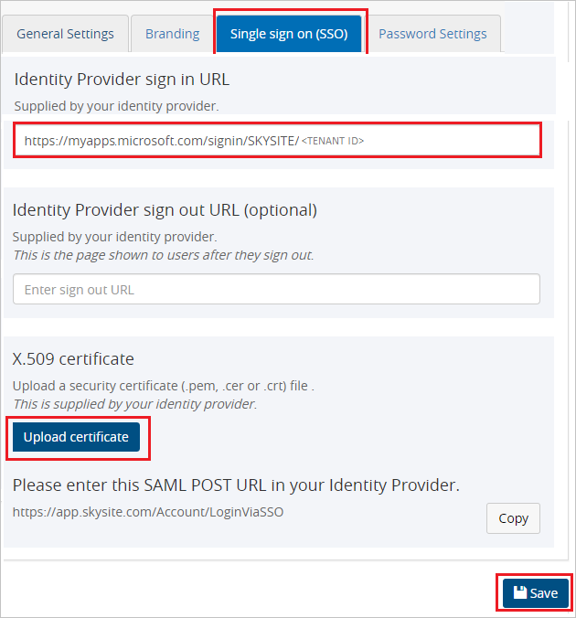

## Prerequisites

To configure Azure AD integration with SKYSITE, you need the following items:

- An Azure AD subscription
- A SKYSITE single sign-on enabled subscription

> **Note:**
> To test the steps in this tutorial, we do not recommend using a production environment.

To test the steps in this tutorial, you should follow these recommendations:

- Do not use your production environment, unless it is necessary.
- If you don't have an Azure AD trial environment, you can get a [free account](https://azure.microsoft.com/free/).

### Configuring SKYSITE for single sign-on

1. Open a new web browser window and sign into your SKYSITE company site as an administrator and perform the following steps:

2. Click on **Settings** on the top right side of page and then navigate to **Account setting**.

	

3. Switch to **Single sign on (SSO)** tab, perform the following steps:

	

	a. In the **Identity Provider sign in URL** text box, paste the value of **User access URL**, which you have copied from the **properties** tab in Azure portal.

	b. Click **Upload certificate**, to upload the Base64 encoded certificate which you have downloaded from the Azure portal.

	c. Click **Save**.

## Quick Reference

* **Login URL** : %metadata:singleSignOnServiceUrl%

* **[Download Azure AD Signing Certifcate](%metadata:CertificateDownloadRawUrl%)**

* **[Download SAML Metadata file](%metadata:metadataDownloadUrl%)**

## Additional Resources

* [How to integrate SKYSITE with Azure Active Directory](https://docs.microsoft.com/azure/active-directory/saas-apps/skysite-tutorial)
