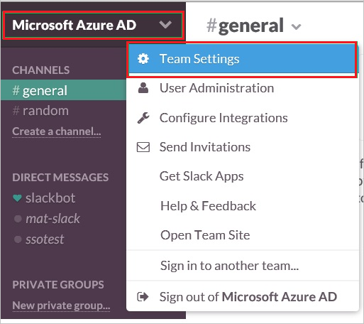
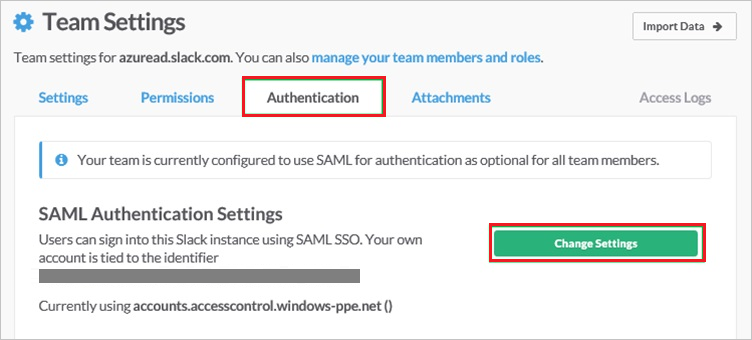
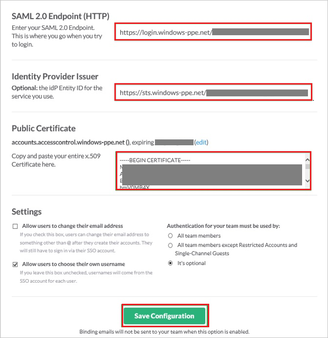

## Prerequisites

To configure Azure AD integration with Slack, you need the following items:

- An Azure AD subscription
- A Slack single sign-on enabled subscription

> **Note:**
> To test the steps in this tutorial, we do not recommend using a production environment.

To test the steps in this tutorial, you should follow these recommendations:

- Do not use your production environment, unless it is necessary.
- If you don't have an Azure AD trial environment, you can get a one-month trial here: [Trial offer](https://azure.microsoft.com/pricing/free-trial/).

### Configuring Slack for single sign-on

1.  In a different web browser window, log in to your Slack company site as an administrator.

2.  Navigate to **Microsoft Azure AD** then go to **Team Settings**.

     

3.  In the **Team Settings** section, click the **Authentication** tab, and then click **Change Settings**.

     

4. On the **SAML Authentication Settings** dialog, perform the following steps:

    

    a.  In the **SAML 2.0 Endpoint (HTTP)** textbox, paste the value of **Azure AD Single Sign-On Service URL** : %metadata:singleSignOnServiceUrl%, which you have copied from Azure portal.

    b.  In the **Identity Provider Issuer** textbox, paste the value of **Azure AD SAML Entity ID** : %metadata:IssuerUri%, which you have copied from Azure portal.

    c.  Open your **[Downloaded Azure AD Signing Certifcate (Base64 encoded)](%metadata:certificateDownloadBase64Url%)** file in notepad, copy the content of it into your clipboard, and then paste it to the **Public Certificate** textbox.

    d. Configure the above three settings as appropriate for your Slack team. For more information about the settings, please find the **Slack's SSO configuration guide** here. `https://get.slack.help/hc/articles/220403548-Guide-to-single-sign-on-with-Slack%60`

    e.  Click **Save Configuration**.
	 
	<!-- Deselect **Allow users to change their email address**.

    e.  Select **Allow users to choose their own username**.

    f.  As **Authentication for your team must be used by**, select **It’s optional**. -->

## Quick Reference

* **Azure AD Single Sign-On Service URL** : %metadata:singleSignOnServiceUrl%

* **Azure AD SAML Entity ID** : %metadata:IssuerUri%

* **[Download Azure AD Signing Certifcate (Base64 encoded)](%metadata:certificateDownloadBase64Url%)**

## Additional Resources

* [How to integrate Slack with Azure Active Directory](https://docs.microsoft.com/azure/active-directory/active-directory-saas-slack-tutorial)
