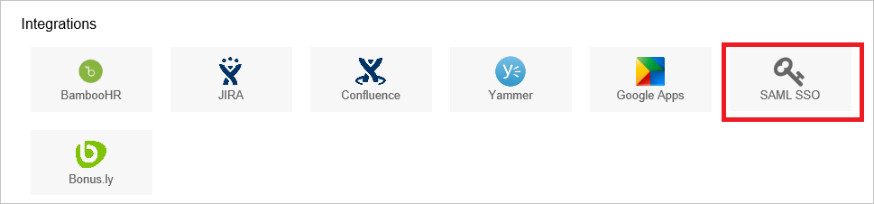

## Prerequisites

To configure Azure AD integration with Small Improvements, you need the following items:

- An Azure AD subscription
- A Small Improvements single sign-on enabled subscription

> **Note:**
> To test the steps in this tutorial, we do not recommend using a production environment.

To test the steps in this tutorial, you should follow these recommendations:

- Do not use your production environment, unless it is necessary.
- If you don't have an Azure AD trial environment, you can get a one-month trial here: [Trial offer](https://azure.microsoft.com/pricing/free-trial/).

### Configuring Small Improvements for single sign-on

1. In another browser window, sign on to your Small Improvements company site as an administrator.

2. From the main dashboard page, click **Administration** button on the left.
   
     

3. Click the **SAML SSO** button from **Integrations** section.
   
     

4. On the SSO Setup page, perform the following steps:
   
      

    a. In the **HTTP Endpoint** textbox, paste the value of **Azure AD Single Sign-On Service URL** : %metadata:singleSignOnServiceUrl%, which you have copied from Azure portal.

    b. Open your **[Downloaded Azure AD Signing Certifcate (Base64 encoded)](%metadata:certificateDownloadBase64Url%)** in Notepad, copy the content, and then paste it into the **x509 Certificate** textbox. 

    c. If you wish to have SSO and Login form authentication option available for users, then check the **Enable access via login/password too** option.  

    d. Enter the appropriate value to Name the SSO Login button in the **SAML Prompt** textbox.  

    e. Click **Save**.

## Quick Reference

* **Azure AD Single Sign-On Service URL** : %metadata:singleSignOnServiceUrl%

* **Azure AD SAML Entity ID** : %metadata:IssuerUri%

* **[Download Azure AD Signing Certifcate (Base64 encoded)](%metadata:certificateDownloadBase64Url%)**

## Additional Resources

* [How to integrate Small Improvements with Azure Active Directory](https://docs.microsoft.com/azure/active-directory/active-directory-saas-smallimprovements-tutorial)
