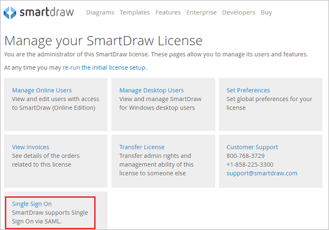

## Prerequisites

To configure Azure AD integration with SmartDraw, you need the following items:

- An Azure AD subscription
- A SmartDraw single sign-on enabled subscription

> **Note:**
> To test the steps in this tutorial, we do not recommend using a production environment.

To test the steps in this tutorial, you should follow these recommendations:

- Do not use your production environment, unless it is necessary.
- If you don't have an Azure AD trial environment, you can [get a one-month trial](https://azure.microsoft.com/pricing/free-trial/).

### Configuring SmartDraw for single sign-on

1. In a different web browser window, login to SmartDraw as an Administrator.

2. Click on **Single Sign-On** under Manage your SmartDraw License.

	

3. On the Configuration page, perform the following steps:

	

	a. In the **Your Domain (like acme.com)** textbox, type your domain.

	b. Copy the **Your SP Initiated Login Url will be** for your instance and paste it in Sign-on URL textbox in **Basic SAML Configuration** on Azure portal.
	
	c. In the **Security Groups to Allow SmartDraw Access** textbox, type **Everyone**.

	d. In the **Your SAML Issuer Url** textbox, paste the value of **Azure AD Identifier** which you have copied from the Azure portal.

	e. In Notepad, open the **[Downloaded SAML Metadata file](%metadata:metadataDownloadUrl%)** from the Azure portal, copy its content, and then paste it into the **Your SAML MetaData** box.

	f. Click **Save Configuration**. 

## Quick Reference

* **Azure AD Login URL** : %metadata:singleSignOnServiceUrl%

* **[Download Azure AD Signing Certifcate](%metadata:CertificateDownloadRawUrl%)**

* **[Download SAML Metadata file](%metadata:metadataDownloadUrl%)**

## Additional Resources

* [How to integrate SmartDraw with Azure Active Directory](https://docs.microsoft.com/azure/active-directory/saas-apps/smartdraw-tutorial)
