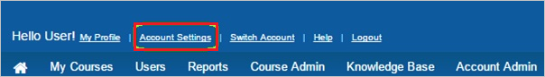
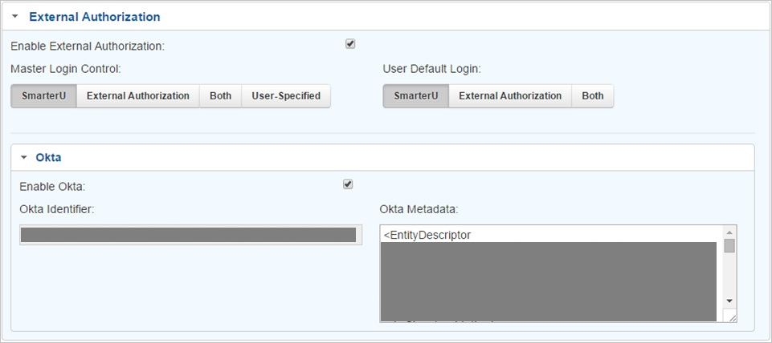

## Prerequisites

To configure Azure AD integration with SmarterU, you need the following items:

- An Azure AD subscription
- A SmarterU single-sign on enabled subscription

> **Note:**
> To test the steps in this tutorial, we do not recommend using a production environment.

To test the steps in this tutorial, you should follow these recommendations:

- Do not use your production environment, unless it is necessary.
- If you don't have an Azure AD trial environment, you can get a one-month trial [here](https://azure.microsoft.com/pricing/free-trial/).

### Configuring SmarterU for single sign-on

1. In a different web browser window, log in to your SmarterU company site as an administrator.

2. In the toolbar on the top, click **Account Settings**.
   
    

3. On the account configuration page, perform the following steps:
   
     
 
      a. Select **Enable External Authorization**.
  
      b. In the **Master Login Control** section, select the **SmarterU** tab.
  
      c. In the **User Default Login** section, select the **SmarterU** tab.
  
      d. Select **Enable Okta**.
  
      e. Copy the content of the **[Download SAML Metadata file](%metadata:metadataDownloadUrl%)**, and then paste it into the **Okta Metadata** textbox.
  
      f. Click **Save**.

## Quick Reference

* **Azure AD Single Sign-On Service URL** : %metadata:singleSignOnServiceUrl%

* **[Download SAML Metadata file](%metadata:metadataDownloadUrl%)**

## Additional Resources

* [How to integrate SmarterU with Azure Active Directory](https://docs.microsoft.com/azure/active-directory/active-directory-saas-smarteru-tutorial)
