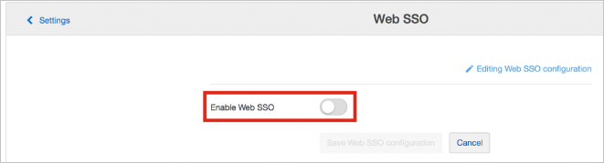

## Prerequisites

To configure Azure AD integration with SmartRecruiters, you need the following items:

- An Azure AD subscription
- A SmartRecruiters single sign-on enabled subscription

> **Note:**
> To test the steps in this tutorial, we do not recommend using a production environment.

To test the steps in this tutorial, you should follow these recommendations:

- Do not use your production environment, unless it is necessary.
- If you don't have an Azure AD trial environment, you can get a one-month trial [here](https://azure.microsoft.com/pricing/free-trial/).

### Configuring SmartRecruiters for single sign-on

1. In a different web browser window, log in to your SmartRecruiters company site as an administrator.

2. Go to **Settings / Admin**.

    

3. In the **Configuration** section, click **Web SSO**.

	

4. Toggle **Enable Web SSO**.

	

5. In **Identity Provider Configuration**, perform the following steps:

	

	a. In **Identity Provider URL** textbox, paste the value of **Azure AD Single Sign-On Service URL** : %metadata:singleSignOnServiceUrl% which you have copied from Azure portal.

	b. Open **[Azure AD Signing Certifcate (Base64 encoded)](%metadata:certificateDownloadBase64Url%)** which you have downloaded from Azure portal and paste the value into **Identity Provider certificate** textbox.

6. Click **Save Web SSO configuration**.

## Quick Reference

* **Azure AD Single Sign-On Service URL** : %metadata:singleSignOnServiceUrl%

* **[Download Azure AD Signing Certifcate (Base64 encoded)](%metadata:certificateDownloadBase64Url%)**

## Additional Resources

* [How to integrate SmartRecruiters with Azure Active Directory](https://docs.microsoft.com/azure/active-directory/active-directory-saas-smartrecruiters-tutorial)
