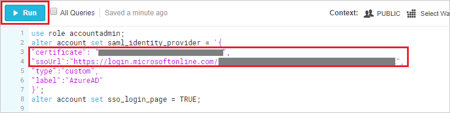

## Prerequisites

To configure Azure AD integration with Snowflake, you need the following items:

- An Azure AD subscription
- A Snowflake single sign-on enabled subscription

> **Note:**
> To test the steps in this tutorial, we do not recommend using a production environment.

To test the steps in this tutorial, you should follow these recommendations:

- Do not use your production environment, unless it is necessary.
- If you don't have an Azure AD trial environment, you can [get a one-month trial](https://azure.microsoft.com/pricing/free-trial/).

### Configuring Snowflake for single sign-on

1. In a different web browser window, login to Snowflake as a Security Administrator.

2. Run the below SQL query on worksheet by setting the **certificate** value to the **[Download Azure AD Signing Certifcate (Base64 encoded)](%metadata:certificateDownloadBase64Url%)** and **ssoUrl** to the **Azure AD Single Sign-On Service URL** : %metadata:singleSignOnServiceUrl% from Azure AD to the value as shown below.

	 

	```
	use role accountadmin;
	alter account set saml_identity_provider = '{
	"certificate": "<Paste the content of downloaded certificate from Azure portal>",
	"ssoUrl":"<SAML single sign-on service URL value which you have copied from the Azure portal>",
	"type":"custom",
	"label":"AzureAD"
	}';
	alter account set sso_login_page = TRUE;
	```
## Quick Reference

* **Azure AD Single Sign-On Service URL** : %metadata:singleSignOnServiceUrl%

* **Azure AD SAML Entity ID** : %metadata:IssuerUri%

* **[Download Azure AD Signing Certifcate (Base64 encoded)](%metadata:certificateDownloadBase64Url%)**


## Additional Resources

* [How to integrate Snowflake with Azure Active Directory](https://docs.microsoft.com/azure/active-directory/saas-apps/snowflake-tutorial)
