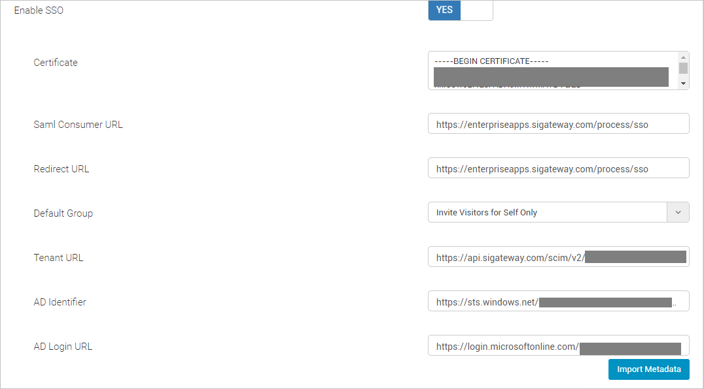
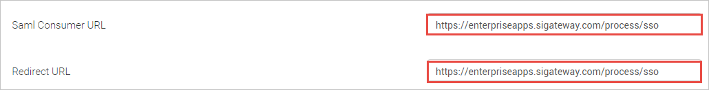
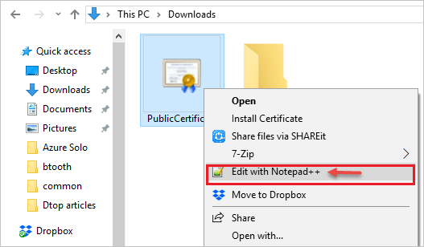
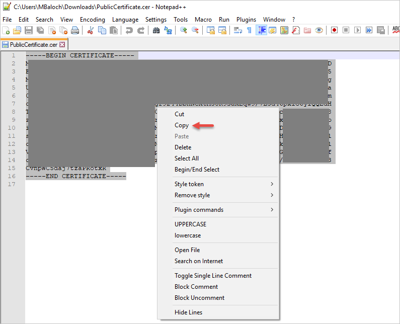
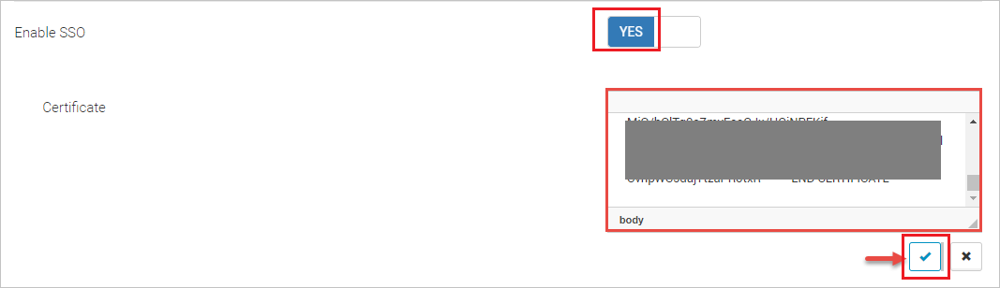
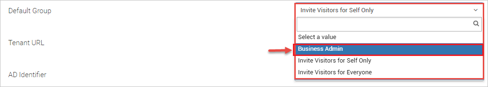
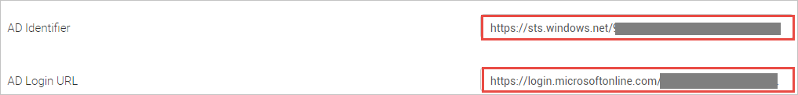

## Prerequisites

To configure Azure AD integration with Soloinsight CloudGate SSO, you need the following items:

- An Azure AD subscription
- A Soloinsight CloudGate SSO single sign-on enabled subscription

> **Note:**
> To test the steps in this tutorial, we do not recommend using a production environment.

To test the steps in this tutorial, you should follow these recommendations:

- Do not use your production environment, unless it is necessary.
- If you don't have an Azure AD trial environment, you can [get a one-month trial](https://azure.microsoft.com/pricing/free-trial/).

### Configuring Soloinsight CloudGate SSO for single sign-on

1. To get the values that are to be pasted in the Azure portal while configuring Basic SAML, login to the CloudGate Web Portal using your credentials then access the SSO settings, which can be found on the following path **Home>Administration>System settings>General**.

	

2. **SAML Consumer URL**

	* Copy the links available against the **Saml Consumer URL** and the **Redirect URL** fields and paste them in the Azure Portal **Basic SAML Configuration** section for **Identifier (Entity ID)** and **Reply URL** fields respectively.

		

3. **SAML Signing Certificate**

	* Go to the source of the Certificate (Base64) file that was downloaded from Azure Portal SAML Signing Certificate lists and right-click on it. Choose **Edit with Notepad++** option from the list. 

		

	* Copy the content in the Certificate (Base64) Notepad++ file.

		

	* Paste the content in the CloudGate Web Portal SSO settings **Certificate** field and click on Save button.

		

4. **Default Group**

	* Select **Business Admin** from the drop-down list of the **Default Group** option in the CloudGate Web Portal

		

5. **AD Identifier and Login URL**

	* The copied **Login URL** from the Azure Portal **Set up Soloinsight-CloudGate SSO** configurations are to be entered in the CloudGate Web Portal SSO settings section. 

	* Paste the **Azure AD Login URL** : %metadata:singleSignOnServiceUrl% link from Azure Portal in the CloudGate Web Portal **AD Login URL** field.
	 
	* Paste the **Azure AD Identifier** link from Azure Portal in the CloudGate Web Portal **AD Identifier** field

		

## Quick Reference

* **Azure AD Login URL** : %metadata:singleSignOnServiceUrl%

* **[Download Azure AD Signing Certifcate (Base64 encoded)](%metadata:certificateDownloadBase64Url%)**

## Additional Resources

* [How to integrate Soloinsight CloudGate SSO with Azure Active Directory](https://docs.microsoft.com/azure/active-directory/saas-apps/soloinsight-cloudgate-sso-tutorial)
