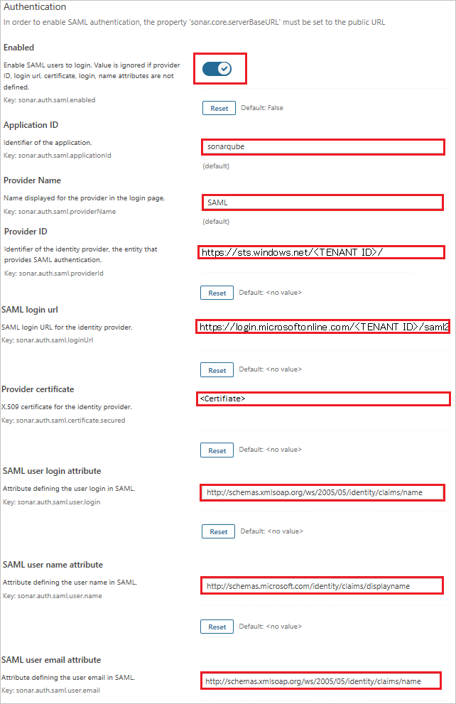

## Prerequisites

To configure Azure AD integration with Sonarqube, you need the following items:

- An Azure AD subscription
- A Sonarqube single sign-on enabled subscription

> **Note:**
> To test the steps in this tutorial, we do not recommend using a production environment.

To test the steps in this tutorial, you should follow these recommendations:

- Do not use your production environment, unless it is necessary.
- If you don't have an Azure AD trial environment, you can get a [free account](https://azure.microsoft.com/free/).

### Configuring Sonarqube for single sign-on

1. Open a new web browser window and sign into your Sonarqube company site as an administrator.

2. Install the SAML plugin from the sonarqube market place.

3. On the top left of the page, click on **ADMIN** and then navigate to **SAML**.

4. On the **SAML** page, perform the following steps:

	

	a. Toggle the **Enabled** option to **yes**.

	b. In **Application ID** text box, enter the name like **sonarqube**.

	c. In **Provider Name** text box, enter the name like **SAML**.

	d. In **Provider ID** text box, paste the value of **Azure AD Identifier**, which you have copied from Azure portal.

	e. In **SAML login url** text box, paste the value of **Login URL** : %metadata:singleSignOnServiceUrl%, which you have copied from Azure portal.

	f. Open the Base64 encoded certificate in notepad, copy its content and paste it into the **Provider certificate** text box.

	g. In **SAML user login attribute** text box, enter the value `http://schemas.xmlsoap.org/ws/2005/05/identity/claims/name`.

	h. In **SAML user name attribute** text box, enter the value `http://schemas.microsoft.com/identity/claims/displayname`.

	i. In **SAML user email attribute** text box, enter the value `http://schemas.xmlsoap.org/ws/2005/05/identity/claims/name`.

	j. Click **Save**.

## Quick Reference

* **Login URL** : %metadata:singleSignOnServiceUrl%

* **[Download Azure AD Signing Certifcate (Base64 encoded)](%metadata:certificateDownloadBase64Url%)**

## Additional Resources

* [How to integrate Sonarqube with Azure Active Directory](https://docs.microsoft.com/azure/active-directory/saas-apps/sonarqube-tutorial)
