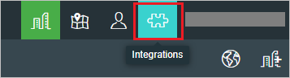
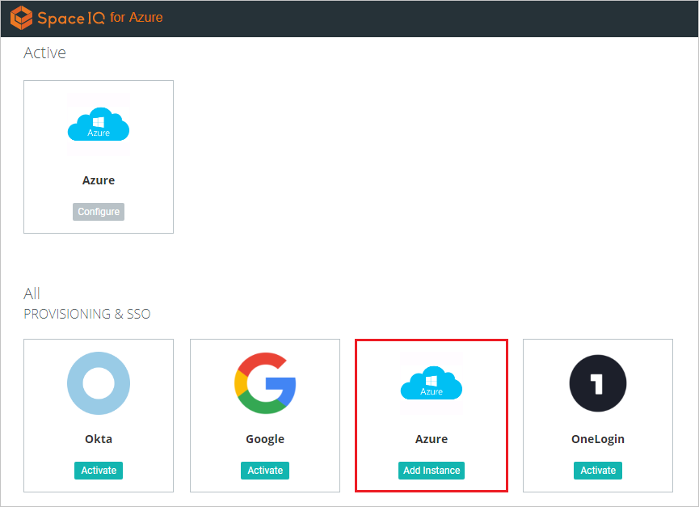
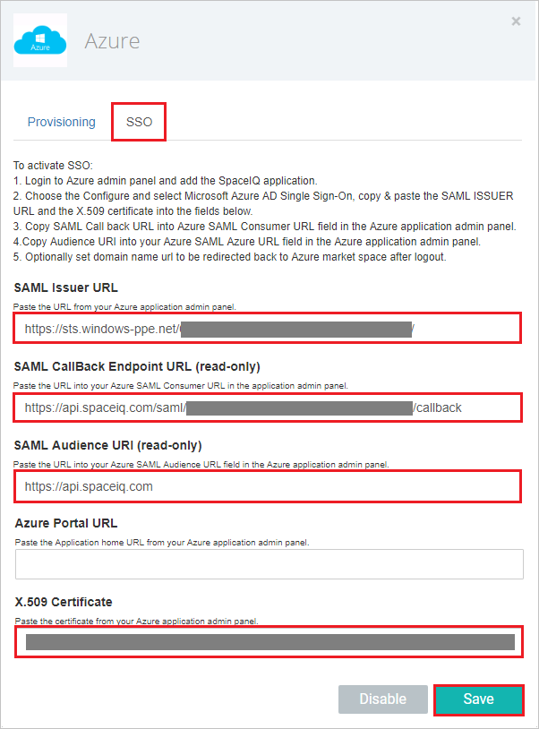

## Prerequisites

To configure Azure AD integration with SpaceIQ, you need the following items:

- An Azure AD subscription
- A SpaceIQ single sign-on enabled subscription

> **Note:**
> To test the steps in this tutorial, we do not recommend using a production environment.

To test the steps in this tutorial, you should follow these recommendations:

- Do not use your production environment, unless it is necessary.
- If you don't have an Azure AD trial environment, you can [get a one-month trial](https://azure.microsoft.com/pricing/free-trial/).

### Configuring SpaceIQ for single sign-on

1.  Open a new browser window, and then sign in to your SpaceIQ environment as an administrator.

2. Once you are logged in, click on the puzzle sign at the top right, then click on **Integrations**

	 

3. Under **All PROVISIONING & SSO**, click on the **Azure** tile to add an instance of Azure as IDP.

	

4. In the **SSO** dialog box, perform the following steps:

    

	a. In the **SAML Issuer URL** box, paste the **Azure AD SAML Entity ID** : %metadata:IssuerUri% value copied from the Azure AD application configuration window.
	
	b. Copy the **SAML CallBack Endpoint URL (read-only)** value and paste the value in the **Reply URL** box in the Azure portal, under SpaceIQ **Domain and URLs** section.
	
	c. Copy the **SAML Audience URI (read-only)** value and paste the value in the **Identifier** box in the Azure portal, under SpaceIQ **Domain and URLs** section.

	d. Open the **[Downloaded Azure AD Signing Certifcate (Base64 encoded)](%metadata:certificateDownloadBase64Url%)** in notepad, copy the content, and then paste it in the **X.509 Certificate** box.
	
	e. Click **Save**.

## Quick Reference

* **Azure AD Single Sign-On Service URL** : %metadata:singleSignOnServiceUrl%

* **Azure AD SAML Entity ID** : %metadata:IssuerUri%

* **[Download Azure AD Signing Certifcate (Base64 encoded)](%metadata:certificateDownloadBase64Url%)**

## Additional Resources

* [How to integrate SpaceIQ with Azure Active Directory](https://docs.microsoft.com/en-us/azure/active-directory/active-directory-saas-spaceiq-tutorial)
