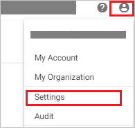
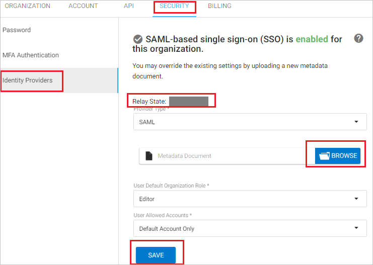

## Prerequisites

To configure Azure AD integration with Spotinst, you need the following items:

- An Azure AD subscription
- A Spotinst single sign-on enabled subscription

> **Note:**
> To test the steps in this tutorial, we do not recommend using a production environment.

To test the steps in this tutorial, you should follow these recommendations:

- Do not use your production environment, unless it is necessary.
- If you don't have an Azure AD trial environment, you can [get a one-month trial](https://azure.microsoft.com/pricing/free-trial/).

### Configuring Spotinst for single sign-on

1. In a different web browser window, login to Spotinst as a Security Administrator.

2. Click on the **user icon** on the top right side of the screen and click **Settings**.

	

3. Click on the **SECURITY** tab on the top and then select **Identity Providers** and perform the following steps:

	

	a. Copy the **Relay State** value for your instance and paste it in **Relay State** textbox in **Spotinst Domain and URLs** section on Azure portal.

	b. Click **BROWSE** to upload the **[Downloaded SAML Metadata file](%metadata:metadataDownloadUrl%)** file that you have downloaded from Azure portal

	c. Click **SAVE**.

## Quick Reference

* **[Download SAML Metadata file](%metadata:metadataDownloadUrl%)**

## Additional Resources

* [How to integrate Spotinst with Azure Active Directory](https://docs.microsoft.com/azure/active-directory/saas-apps/spotinst-tutorial)
