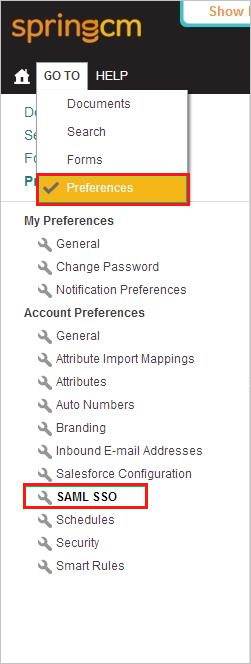
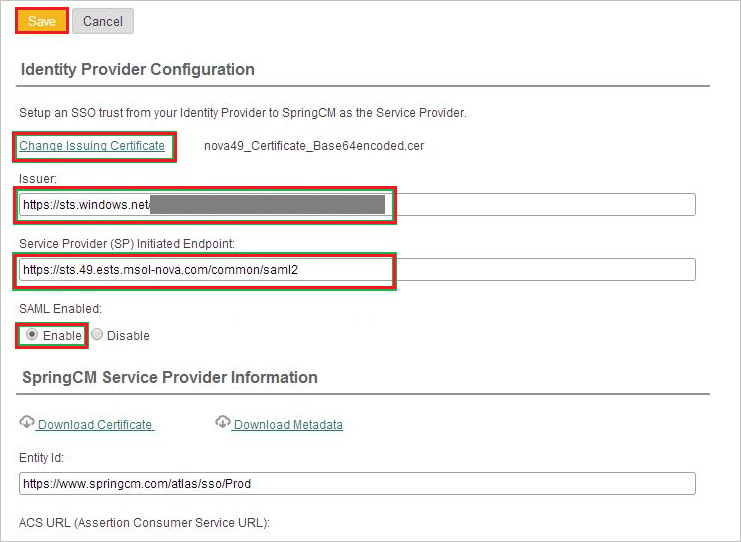

## Prerequisites

To configure Azure AD integration with SpringCM, you need the following items:

- An Azure AD subscription
- A SpringCM single-sign on enabled subscription

> **Note:**
> To test the steps in this tutorial, we do not recommend using a production environment.

To test the steps in this tutorial, you should follow these recommendations:

- Do not use your production environment, unless it is necessary.
- If you don't have an Azure AD trial environment, you can get a one-month trial [here](https://azure.microsoft.com/pricing/free-trial/).

### Configuring SpringCM for single sign-on

1. In a different web browser window, sign on to your **SpringCM** company site as administrator.

2. In the menu on the top, click **GO TO**, click **Preferences**, and then, in the **Account Preferences** section, click **SAML SSO**.
   
    

3. In the Identity Provider Configuration section, perform the following steps:
   
     

	 a. To upload your **[Downloaded Azure AD Signing Certificate](%metadata:CertificateDownloadRawUrl%)**, click **Select Issuer Certificate** or **Change Issuer Certificate**.
  	
	  b. paste **Azure AD SAML Entity ID** : %metadata:IssuerUri% value into the **Issuer** textbox.
  	
	  c. paste **Azure AD Single Sign-On Service URL** : %metadata:singleSignOnServiceUrl% value into the **Service Provider (SP) Initiated Endpoint** textbox.
	    	
	  d. As **SAML Enabled**, select **Enable**.

## Quick Reference

* **Azure AD Single Sign-On Service URL** : %metadata:singleSignOnServiceUrl%

* **Azure AD SAML Entity ID** : %metadata:IssuerUri%

* **[Download Azure AD Signing Certificate](%metadata:CertificateDownloadRawUrl%)**

## Additional Resources

* [How to integrate SpringCM with Azure Active Directory](https://docs.microsoft.com/azure/active-directory/active-directory-saas-spring-cm-tutorial)
