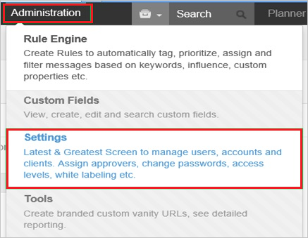
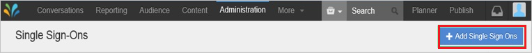
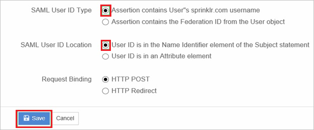

## Prerequisites

To configure Azure AD integration with Sprinklr, you need the following items:

- An Azure AD subscription
- A Sprinklr single-sign on enabled subscription

> **Note:**
> To test the steps in this tutorial, we do not recommend using a production environment.

To test the steps in this tutorial, you should follow these recommendations:

- Do not use your production environment, unless it is necessary.
- If you don't have an Azure AD trial environment, you can get an one-month trial [here](https://azure.microsoft.com/pricing/free-trial/).

### Configuring Sprinklr for single sign-on

1. In a different web browser window, log in to your Sprinklr company site as an administrator.

2. Go to **Administration \> Settings**.
   
    

3. Go to **Manage Partner \> Single Sign** on from the left pane.
   
    

4. Click **+Add Single Sign Ons**.
   
    

5. On the **Single Sign on** page, perform the following steps:
   
    

    a. In the **Name** textbox, type a name for your configuration (for example: *WAADSSOTest*).

    b. Select **Enabled**.

    c. Select **Use new SSO Certificate**.
             
    e. Open your **[Downloaded Azure AD Signing Certifcate (Base64 encoded)](%metadata:certificateDownloadBase64Url%)** in notepad, copy the content of it into your clipboard, and then paste it to the **Identity Provider Certificate** textbox.

    f. Paste the **Azure AD SAML Entity ID** : %metadata:IssuerUri% value from Azure portal into the **Entity Id** textbox.

    g. Paste the **Azure AD Single Sign-On Service URL** : %metadata:singleSignOnServiceUrl% value from Azure portal into the **Identity Provider Login URL** textbox.

    h. Paste the **Azure AD Sign Out URL** : %metadata:singleSignOutServiceUrl% value from Azure portal into the **Identity Provider Logout URL** textbox.
     
    i. As **SAML User ID Type**, select **Assertion contains User”s sprinklr.com username**.

    j. As **SAML User ID Location**, select **User ID is in the Name Identifier element of the Subject statement**.

    k. Click **Save**.
       
    

## Quick Reference

* **Azure AD Single Sign-On Service URL** : %metadata:singleSignOnServiceUrl%

* **Azure AD Sign Out URL** : %metadata:singleSignOutServiceUrl%

* **Azure AD SAML Entity ID** : %metadata:IssuerUri%

* **[Download Azure AD Signing Certifcate (Base64 encoded)](%metadata:certificateDownloadBase64Url%)**

## Additional Resources

* [How to integrate Sprinklr with Azure Active Directory](https://docs.microsoft.com/azure/active-directory/active-directory-saas-sprinklr-tutorial)
