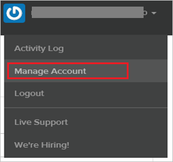

## Prerequisites

To configure Azure AD integration with StatusPage, you need the following items:

- An Azure AD subscription
- A StatusPage single sign-on enabled subscription

> **Note:**
> To test the steps in this tutorial, we do not recommend using a production environment.

To test the steps in this tutorial, you should follow these recommendations:

- Do not use your production environment, unless it is necessary.
- If you don't have an Azure AD trial environment, you can get a one-month trial here: [Trial offer](https://azure.microsoft.com/pricing/free-trial/).

### Configuring StatusPage for single sign-on

1. In another browser window, sign on to your StatusPage company site as an administrator.

2. In the main toolbar, click **Manage Account**.
   
     

3. Click the **Single Sign-on** tab. 
   
     

4. On the SSO Setup page, perform the following steps:
   
     

	 
 
    a. In the **SSO Target URL** textbox, paste the value of **Azure AD Single Sign-On Service URL** : %metadata:singleSignOnServiceUrl%, which you have copied from Azure portal.

    b. Open your **[Downloaded Azure AD Signing Certifcate (Base64 encoded)](%metadata:certificateDownloadBase64Url%)** in Notepad, copy the content, and then paste it into the **Certificate** textbox. 

    c. Click **SAVE CONFIGURATION**.

## Quick Reference

* **Azure AD Single Sign-On Service URL** : %metadata:singleSignOnServiceUrl%

* **Azure AD Sign Out URL** : %metadata:singleSignOutServiceUrl%

* **Azure AD SAML Entity ID** : %metadata:IssuerUri%

* **[Download Azure AD Signing Certifcate (Base64 encoded)](%metadata:certificateDownloadBase64Url%)**

## Additional Resources

* [How to integrate StatusPage with Azure Active Directory](https://docs.microsoft.com/azure/active-directory/active-directory-saas-statuspage-tutorial)
