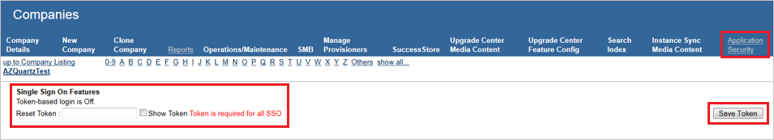
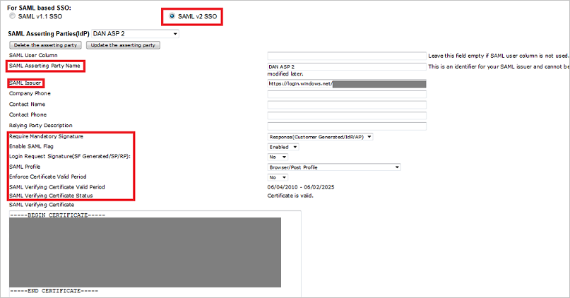
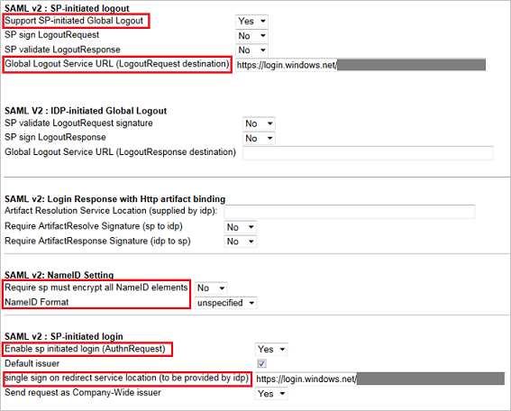
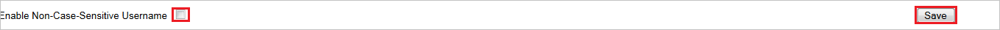

## Prerequisites

To configure Azure AD integration with SuccessFactors, you need the following items:

- An Azure AD subscription
- A SuccessFactors single-sign on enabled subscription

> **Note:**
> To test the steps in this tutorial, we do not recommend using a production environment.

To test the steps in this tutorial, you should follow these recommendations:

- Do not use your production environment, unless it is necessary.
- If you don't have an Azure AD trial environment, you can get a one-month trial [here](https://azure.microsoft.com/pricing/free-trial/).

### Configuring SuccessFactors for single sign-on

1. In a different web browser window, log in to your **SuccessFactors admin portal** as an administrator.
	
2. Visit **Application Security** and native to **Single Sign On Feature**. 

3. Place any value in the **Reset Token** and click **Save Token** to enable SAML SSO.
      
	 

    > **Note:** 
    > This value is used as the on/off switch. If any value is saved, the SAML SSO is ON. If a blank value is saved the SAML SSO is OFF.

4. Native to below screenshot and perform the following actions:
   
    
   
    a. Select the **SAML v2 SSO** Radio Button
   
    b. Set the SAML Asserting Party Name(for example, SAML issuer + company name).
   
    c. In the **Issuer URL** textbox, paste the **SAML Entity ID** value you have copied from the **Azure AD SMAL Entity ID** : %metadata:IssuerUri% window of the Azure portal.
   
    d. Select **Response(Customer Generated/IdP/AP)** as **Require Mandatory Signature**.
   
    e. Select **Enabled** as **Enable SAML Flag**.
   
    f. Select **No** as **Login Request Signature(SF Generated/SP/RP)**.
   
    g. Select **Browser/Post Profile** as **SAML Profile**.
   
    h. Select **No** as **Enforce Certificate Valid Period**.
   
    i. Copy the content of the downloaded certificate file, and then paste it into the **SAML Verifying Certificate** textbox.

    > **Note:** 
    > The certificate content must have begin certificate and end certificate tags.

5. Navigate to SAML V2, and then perform the following steps:
   
    
   
    a. Select **Yes** as **Support SP-initiated Global Logout**.
   
    b. In, the **Global Logout Service URL (LogoutRequest destination)** textbox put the value of **Azure AD Sign Out URL** : %metadata:singleSignOutServiceUrl% from Azure AD application configuration wizard.
   
    c. Select **No** as **Require sp must encrypt all NameID element**.
   
    d. Select **unspecified** as **NameID Format**.
   
    e. Select **Yes** as **Enable sp initiated login (AuthnRequest)**.
   
    f. In, the **Send request as Company-Wide issuer** textbox put the value of **Azure AD Single Sign-On Service URL** : %metadata:singleSignOnServiceUrl% from Azure AD application configuration wizard.
6. Perform these steps if you want to make the login usernames Case Insensitive.
   
	a. Visit **Company Settings**(near the bottom).
   
	b. select checkbox near **Enable Non-Case-Sensitive Username**.
   
	c.Click **Save**.
   
	

    > **Note:** 
    > If you try to enable this, the system checks if it creates a duplicate SAML login name. For example if the customer has usernames User1 and user1. Taking away case sensitivity makes these duplicates. The system gives you an error message and does not enable the feature. The customer needs to change one of the usernames so it’s spelled different. 

## Quick Reference

* **Azure AD Single Sign-On Service URL** : %metadata:singleSignOnServiceUrl%

* **Azure AD Sign Out URL** : %metadata:singleSignOutServiceUrl%

* **Azure AD SAML Entity ID** : %metadata:IssuerUri%

* **[Download Azure AD Signing Certificate (Base64 encoded)](%metadata:certificateDownloadBase64Url%)**

## Additional Resources

* [How to integrate SuccessFactors with Azure Active Directory](https://docs.microsoft.com/azure/active-directory/active-directory-saas-successfactors-tutorial)