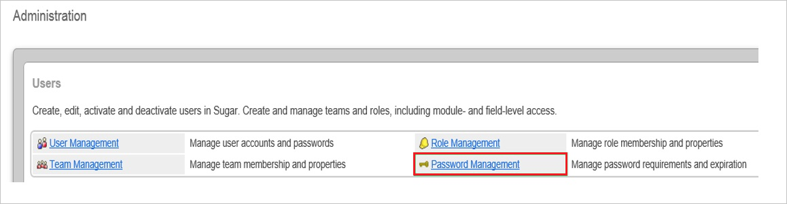
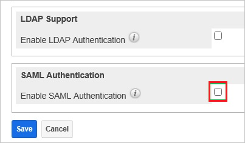

## Prerequisites

To configure Azure AD integration with Sugar CRM, you need the following items:

- An Azure AD subscription
- A Sugar CRM single sign-on enabled subscription

> **Note:**
> To test the steps in this tutorial, we do not recommend using a production environment.

To test the steps in this tutorial, you should follow these recommendations:

- Do not use your production environment, unless it is necessary.
- If you don't have an Azure AD trial environment, you can get a one-month trial here: [Trial offer](https://azure.microsoft.com/pricing/free-trial/).

### Configuring Sugar CRM for single sign-on

1. In a different web browser window, log in to your Sugar CRM company site as an administrator.

2. Go to **Admin**.
   
    

3. In the **Administration** section, click **Password Management**.
   
    

4. Select **Enable SAML Authentication**.
   
    

5. In the **SAML Authentication** section, perform the following steps:
   
      
 
    a. In the **Login URL** textbox, paste the value of **Azure AD Single Sign-On Service URL** : %metadata:singleSignOnServiceUrl%, which you have copied from Azure portal.
  
    b. In the **SLO URL** textbox, paste the value of **Sign-Out URL**, which you have copied from Azure portal.
  
    c. Open your **[Downloaded Azure AD Signing Certifcate (Base64 encoded)](%metadata:certificateDownloadBase64Url%)** in notepad, copy the content of it into your clipboard, and then paste the entire Certificate into **X.509 Certificate** textbox.
  
    d. Click **Save**.

## Quick Reference

* **Azure AD Single Sign-On Service URL** : %metadata:singleSignOnServiceUrl%

* **[Download Azure AD Signing Certifcate (Base64 encoded)](%metadata:certificateDownloadBase64Url%)**

## Additional Resources

* [How to integrate Sugar CRM with Azure Active Directory](https://docs.microsoft.com/azure/active-directory/active-directory-saas-sugarcrm-tutorial)
