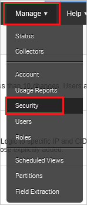
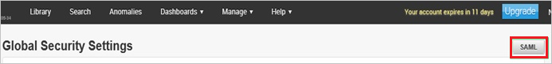
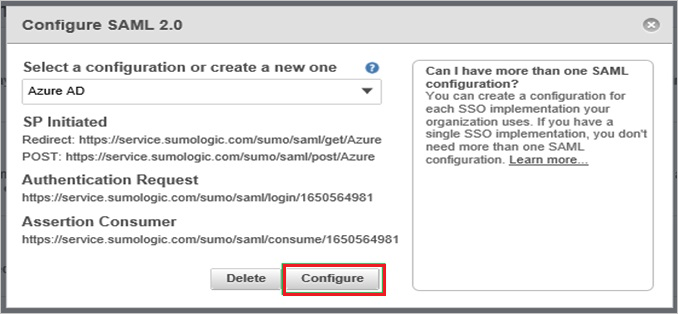
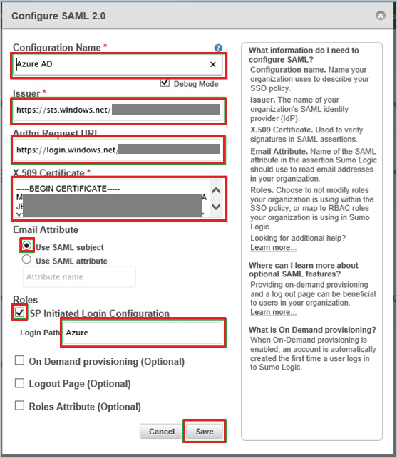

## Prerequisites

To configure Azure AD integration with SumoLogic, you need the following items:

- An Azure AD subscription
- A SumoLogic single sign-on enabled subscription

> **Note:**
> To test the steps in this tutorial, we do not recommend using a production environment.

To test the steps in this tutorial, you should follow these recommendations:

- Do not use your production environment, unless it is necessary.
- If you don't have an Azure AD trial environment, you can get a one-month trial here: [Trial offer](https://azure.microsoft.com/pricing/free-trial/).

### Configuring SumoLogic for single sign-on

1. In a different web browser window, log in to your SumoLogic company site as an administrator.

2. Go to **Manage \> Security**.
   
    

3. Click **SAML**.
   
    

4. From the **Select a configuration or create a new one** list, select **Azure AD**, and then click **Configure**.
   
    

5. On the **Configure SAML 2.0** dialog, perform the following steps:
   
    
   
    a. In the **Configuration Name** textbox, type **Azure AD**. 

    b. Select **Debug Mode**.

    c. In the **Issuer** textbox, paste the value of **Azure AD SAML Entity ID** : %metadata:IssuerUri%, which you have copied from Azure portal. 

    d. In the **Authn Request URL** textbox, paste the value of **Azure AD Single Sign-On Service URL** : %metadata:singleSignOnServiceUrl%, which you have copied from Azure portal.

    e. Open your **[Downloaded Azure AD Signing Certifcate (Base64 encoded)](%metadata:certificateDownloadBase64Url%)** in notepad, copy the content of it into your clipboard, and then paste the entire Certificate into **X.509 Certificate** textbox.

    f. As **Email Attribute**, select **Use SAML subject**.  

    g. Select **SP initiated Login Configuration**.

    h. In the **Login Path** textbox, type **Azure** and click **Save**.

## Quick Reference

* **Azure AD Single Sign-On Service URL** : %metadata:singleSignOnServiceUrl%

* **Azure AD SAML Entity ID** : %metadata:IssuerUri%

* **[Download Azure AD Signing Certifcate (Base64 encoded)](%metadata:certificateDownloadBase64Url%)**

## Additional Resources

* [How to integrate SumoLogic with Azure Active Directory](https://docs.microsoft.com/azure/active-directory/active-directory-saas-sumologic-tutorial)
