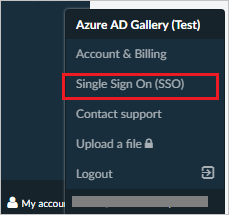
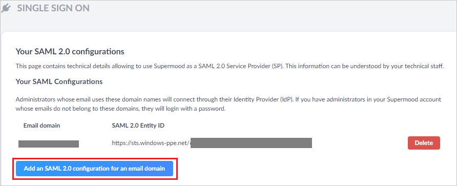
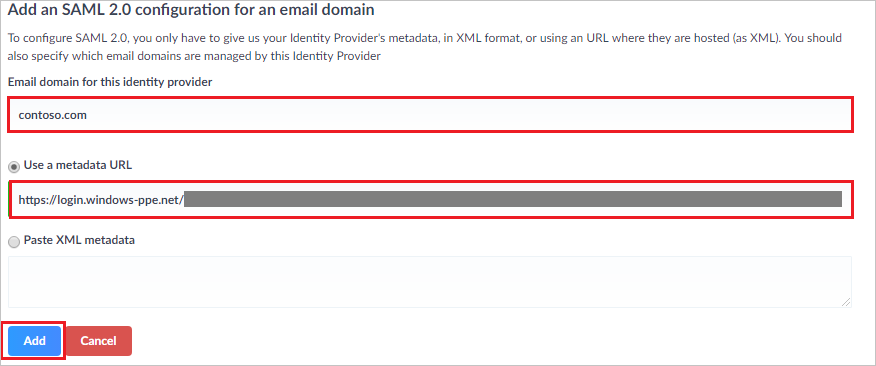

## Prerequisites

To configure Azure AD integration with Supermood, you need the following items:

- An Azure AD subscription
- A Supermood single sign-on enabled subscription

> **Note:**
> To test the steps in this tutorial, we do not recommend using a production environment.

To test the steps in this tutorial, you should follow these recommendations:

- Do not use your production environment, unless it is necessary.
- If you don't have an Azure AD trial environment, you can [get a one-month trial](https://azure.microsoft.com/pricing/free-trial/).

### Configuring Supermood for single sign-on

1. Go to your Supermood.co admin panel as Security Administrator.

2. Click on **My account** (bottom left) and **Single Sign On (SSO)**.

	

3. On **Your SAML 2.0 configurations**, Click **Add an SAML 2.0 configuration for an email domain**.

	

4. On **Add an SAML 2.0 configuration for an email domain**. section, perform the following steps:

	

	a. In the **email domain for this Identity provider** textbox, type your domain.

	b. In the **Use a metadata URL** textbox, paste the **[Downloaded SAML Metadata file](%metadata:metadataDownloadUrl%)** which you have copied from Azure portal.

	c. Click **Add**.

## Quick Reference

* **[Download Azure AD Signing Certifcate](%metadata:CertificateDownloadRawUrl%)**

* **[Download SAML Metadata file](%metadata:metadataDownloadUrl%)**

## Additional Resources

* [How to integrate Supermood with Azure Active Directory](https://docs.microsoft.com/azure/active-directory/active-directory-saas-supermood-tutorial)
