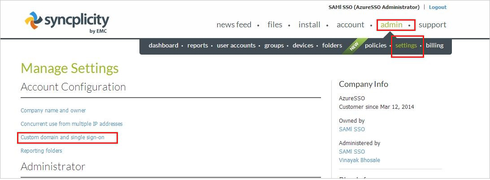

## Prerequisites

To configure Azure AD integration with Syncplicity, you need the following items:

- An Azure AD subscription
- A Syncplicity single-sign on enabled subscription

> **Note:**
> To test the steps in this tutorial, we do not recommend using a production environment.

To test the steps in this tutorial, you should follow these recommendations:

- Do not use your production environment, unless it is necessary.
- If you don't have an Azure AD trial environment, you can get a one-month trial [here](https://azure.microsoft.com/pricing/free-trial/).

### Configuring Syncplicity for single sign-on

1. Sign in to your **Syncplicity** tenant.

2. In the menu on the top, click **admin**, select **settings**, and then click **Custom domain and single sign-on**.
   
    

3. On the **Single Sign-On (SSO)** dialog page, perform the following steps:
   
    ")   

    a. In the **Custom Domain** textbox, type the name of your domain.
  
    b. Select **Enabled** as **Single Sign-On Status**.

    c. In the **Entity Id** textbox, Paste the value of **SAML Entity ID** which you have copied from Azure portal.

    d. In the **Sign-in page URL** textbox, Paste the **Azure AD Single Sign-On Service URL** : %metadata:singleSignOnServiceUrl%
    which you have copied from Azure portal.

    e. In the **Logout page URL** textbox, Paste the **Azure AD Sign Out URL** : %metadata:singleSignOutServiceUrl% which you have copied from Azure portal.

    f. In **Identity Provider Certificate**, click **Choose file**, and then upload the certificate which you have **[Downloaded Azure AD Signing Certifcate (Base64 encoded)](%metadata:certificateDownloadBase64Url%)** from the Azure portal. 

    g. Click **SAVE CHANGES**.

## Quick Reference

* **Azure AD Single Sign-On Service URL** : %metadata:singleSignOnServiceUrl%

* **Azure AD Sign Out URL** : %metadata:singleSignOutServiceUrl%

* **[Download Azure AD Signing Certifcate (Base64 encoded)](%metadata:certificateDownloadBase64Url%)**

## Additional Resources

* [How to integrate Syncplicity with Azure Active Directory](https://docs.microsoft.com/azure/active-directory/active-directory-saas-syncplicity-tutorial)
