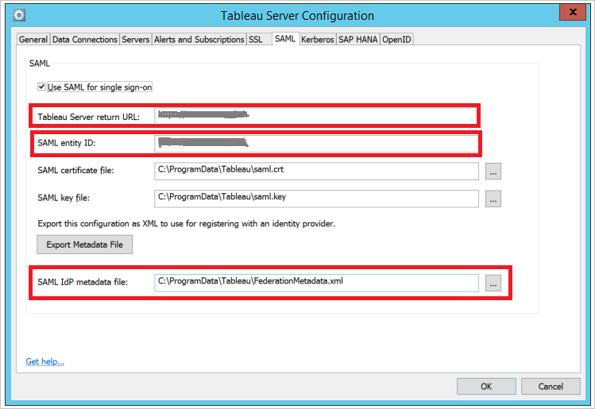

## Prerequisites

To configure Azure AD integration with Tableau Server, you need the following items:

- An Azure AD subscription
- A Tableau Server single-sign on enabled subscription

> **Note:**
> To test the steps in this tutorial, we do not recommend using a production environment.

To test the steps in this tutorial, you should follow these recommendations:

- Do not use your production environment, unless it is necessary.
- If you don't have an Azure AD trial environment, you can get a one-month trial [here](https://azure.microsoft.com/pricing/free-trial/).

### Configuring Tableau Server for single sign-on

1. To get SSO configured for your application, you need to sign-on to your Tableau Server tenant as an administrator.
   
   a. In the Tableau Server configuration, click the **SAML** tab.
  
   
  
   b. Select the checkbox of **Use SAML for single sign-on**.
   
   c. Tableau Server return URL—The URL that Tableau Server users will be accessing, such as http://tableau_server. Using http://localhost is not recommended. Using a URL with a trailing slash (for example, http://tableau_server/) is not supported. Copy **Tableau Server return URL** and paste it to Azure AD **Sign On URL** textbox in **Tableau Server Domain and URLs** section.
   
   d. SAML entity ID—The entity ID uniquely identifies your Tableau Server installation to the IdP. You can enter your Tableau Server URL again here, if you like, but it does not have to be your Tableau Server URL. Copy **SAML entity ID** and paste it to Azure AD **Identifier** textbox in **Tableau Server Domain and URLs** section.
     
   e. Click the **Export Metadata File** and open it in the text editor application. Locate Assertion Consumer Service URL with Http Post and Index 0 and copy the URL. Now paste it to Azure AD **Reply URL** textbox in **Tableau Server Domain and URLs** section.
   
   f. Locate your Federation Metadata file downloaded from Azure portal, and then upload it in the **SAML Idp metadata file**.
   
   g. Click the **OK** button in the Tableau Server Configuration page.
   
> **Note:** 
> Customer have to upload any certificate in the Tableau Server SAML SSO configuration and it will get ignored in the SSO flow.
> If you need help configuring SAML on Tableau Server then please refer to this article [Configure SAML](http://onlinehelp.tableau.com/current/server/en-us/config_saml.htm).
  
## Quick Reference

* **[Download SAML Metadata file](%metadata:metadataDownloadUrl%)**

## Additional Resources

* [How to integrate Tableau Server with Azure Active Directory](https://docs.microsoft.com/azure/active-directory/active-directory-saas-tableauserver-tutorial)

