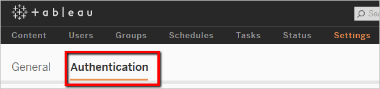
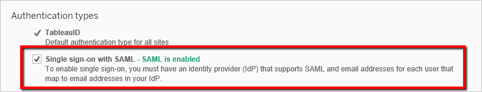
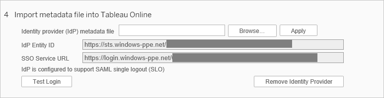
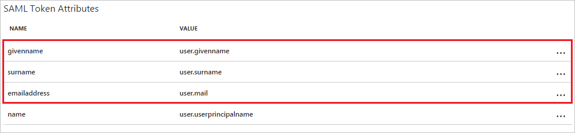
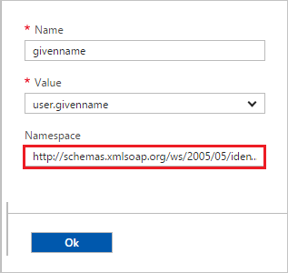

## Prerequisites

To configure Azure AD integration with Tableau Online, you need the following items:

- An Azure AD subscription
- A Tableau Online single-sign on enabled subscription

> **Note:**
> To test the steps in this tutorial, we do not recommend using a production environment.

To test the steps in this tutorial, you should follow these recommendations:

- Do not use your production environment, unless it is necessary.
- If you don't have an Azure AD trial environment, you can get a one-month trial [here](https://azure.microsoft.com/pricing/free-trial/).

### Configuring Tableau Online for single sign-on

1. In a different browser window, sign-on to your Tableau Online application. Go to **Settings** and then **Authentication**.
   
    
	
2. To enable SAML, Under **Authentication Types** section. Check the **Single sign-on with SAML** checkbox.
   
    

3. Scroll down until **Import metadata file into Tableau Online** section.  Click Browse and import the **[Downloaded SAML Metadata file](%metadata:metadataDownloadUrl%)**. Then, click **Apply**.
   
   

4. In the **Match assertions** section, insert the corresponding Identity Provider assertion name for **email address, first name, and last name**. To get this information from Azure AD: 
  
 	a. In the Azure portal, go on the **Tableau Online** application integration page.
  	
	b. In the attributes section, Select the **"view and edit all other user attributes"** checkbox. 
  	
   
	  
	c. Copy the namespace value for these attributes: givenname, email and surname by using the following steps:

   
	
	d. Click **user.givenname** value 
    
    e. Copy the value from the **namespace** textbox.

   

    f. To copy the namesapce values for the email and surname follow the preceding steps.

  	g. Switch to the Tableau Online application, then set the **Tableau Online Attributes** section as follows:
     * Email: **mail** or **userprincipalname**
     * First name: **givenname**
     * Last name: **surname**
   
   

## Quick Reference

* **[Download SAML Metadata file](%metadata:metadataDownloadUrl%)**

## Additional Resources

* [How to integrate Tableau Online with Azure Active Directory](https://docs.microsoft.com/azure/active-directory/active-directory-saas-tableauonline-tutorial)
