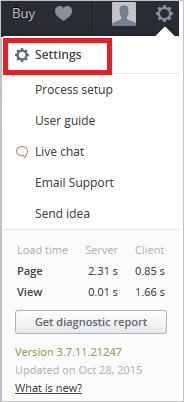
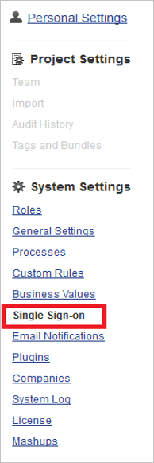

## Prerequisites

To configure Azure AD integration with TargetProcess, you need the following items:

- An Azure AD subscription
- A TargetProcess single sign-on enabled subscription

> **Note:**
> To test the steps in this tutorial, we do not recommend using a production environment.

To test the steps in this tutorial, you should follow these recommendations:

- Do not use your production environment, unless it is necessary.
- If you don't have an Azure AD trial environment, you can get a one-month trial [here](https://azure.microsoft.com/pricing/free-trial/).

### Configuring TargetProcess for single sign-on

1. Sign-on to your TargetProcess application as an administrator.

2. In the menu on the top, click **Setup**.
   
    

3. Click **Settings**.
   
     

4. Click **Single Sign-on**.
   
     

5. On the Single Sign-on settings dialog, perform the following steps:
   
    
	
	a. Click **Enable Single Sign-on**.
    
	b. In **Sign-on URL** textbox, paste the value of **Azure AD Single Sign-On Service URL** : %metadata:singleSignOnServiceUrl% which you have copied from Azure portal.

	c. Open your **[Downloaded Azure AD Signing Certifcate (Base64 encoded)](%metadata:certificateDownloadBase64Url%)** in notepad, copy the content, and then paste it into the **Certificate** textbox.
    
	d. click **Enable JIT Provisioning**.

	e. Click **Save**.

## Quick Reference

* **Azure AD Single Sign-On Service URL** : %metadata:singleSignOnServiceUrl%

* **[Download Azure AD Signing Certifcate (Base64 encoded)](%metadata:certificateDownloadBase64Url%)**

## Additional Resources

* [How to integrate TargetProcess with Azure Active Directory](https://docs.microsoft.com/azure/active-directory/active-directory-saas-target-process-tutorial)
