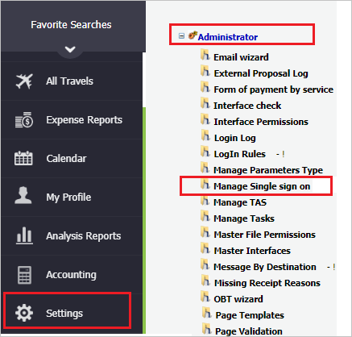
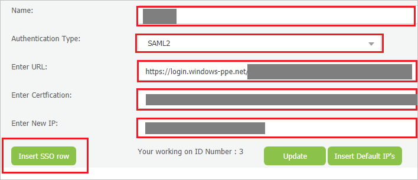

## Prerequisites

To configure Azure AD integration with TAS, you need the following items:

- An Azure AD subscription
- A TAS single sign-on enabled subscription

> **Note:**
> To test the steps in this tutorial, we do not recommend using a production environment.

To test the steps in this tutorial, you should follow these recommendations:

- Do not use your production environment, unless it is necessary.
- If you don't have an Azure AD trial environment, you can [get a one-month trial](https://azure.microsoft.com/pricing/free-trial/).

### Configuring TAS for single sign-on

1. In a different web browser window, login to TAS as an Administrator.

2. On the left side of menu, click on **Settings** and navigate to **Administrator** and then click on **Manage Single sign on**.

	

3. On the **Manage Single sign on** page, perform the following steps:

	

	a. In the **Name** textbox, type your environment name.
	
	b. Select **SAML2** as **Authentication Type**.

	c. In the **Enter URL** textbox, paste the value of **Login URL** : %metadata:singleSignOnServiceUrl% which you have copied from the Azure portal.

	d. In Notepad, open the **[Downloaded Azure AD Signing Certifcate (Base64 encoded)](%metadata:certificateDownloadBase64Url%)** from the Azure portal, copy its content, and then paste it into the **Enter Certfication** box.

	e. In the **Enter New IP** textbox, type the IP Address.

	> **Note:**
	> Contact [TAS support team](mailto:support@combtas.com) to get the IP Address.

	f. Copy the **Single Sign On** url and paste it into the **identifier (Entity ID)** and **Sign on URL** textbox of **Basic SAML Configuration** in Azure portal. Please note that the url is case sensitive and must end with a slash (/).

	g. Copy the **Assertion Service** url in the setup page and paste it into the **Reply URL** textbox of  **Basic SAML Configuration** in Azure portal.

	h. Click **Insert SSO row**.

## Quick Reference

* **Azure AD Login URL** : %metadata:singleSignOnServiceUrl%

* **Azure AD Logout URL** : %metadata:singleSignOutServiceUrl%

* **Azure AD Identifier** : %metadata:IssuerUri%

* **[Download Azure AD Signing Certifcate (Base64 encoded)](%metadata:certificateDownloadBase64Url%)**

## Additional Resources

* [How to integrate TAS with Azure Active Directory](https://docs.microsoft.com/azure/active-directory/saas-apps/tas-tutorial)
