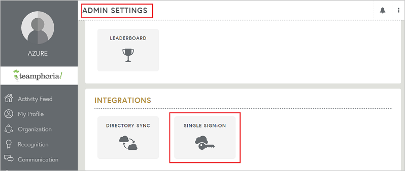

## Prerequisites

To configure Azure AD integration with Teamphoria, you need the following items:

- An Azure AD subscription
- A Teamphoria single-sign on enabled subscription

> **Note:**
> To test the steps in this tutorial, we do not recommend using a production environment.

To test the steps in this tutorial, you should follow these recommendations:

- Do not use your production environment, unless it is necessary.
- If you don't have an Azure AD trial environment, you can get a one-month trial [here](https://azure.microsoft.com/pricing/free-trial/).

### Configuring Teamphoria for single sign-on

1. To configure single sign-on on **Teamphoria** side, Login to your Teamphoria application as an administrator.

2. Go to **ADMIN SETTINGS** option in the left toolbar and under the Configure Tab click **SINGLE SIGN-ON** to open the SSO configuration window.

	

3. Click **ADD NEW IDENTITY PROVIDER** option in the top right corner to open the form for adding the settings for SSO.

	

4. Enter the details in the fields as described below-

	

	a. **DISPLAY NAME** : Enter the display name of the plugin on the admin page.

	b. **BUTTON NAME** : The name of the tab that displays on the login page for logging in via SSO.

	c. **CERTIFICATE** : Open the **[Download Azure AD Signing Certificate (Base64 encoded)](%metadata:certificateDownloadBase64Url%)** earlier from the Azure portal in notepad, copy the contents of the same and paste it here in the box.

	d. **ENTRY POINT** : Paste the **Azure AD Single Sign-On Service URL** : %metadata:singleSignOnServiceUrl% copied earlier form the Azure portal.

	e. Switch the option to **ON** and click **SAVE**.	

## Quick Reference

* **Azure AD Single Sign-On Service URL** : %metadata:singleSignOnServiceUrl%

* **[Download Azure AD Signing Certificate (Base64 encoded)](%metadata:certificateDownloadBase64Url%)**

## Additional Resources

* [How to integrate Teamphoria with Azure Active Directory](active-directory-saas-teamphoria-tutorial.md)
* [How to configure user provisioning with Teamphoria](active-directory-saas-teamphoria-user-provisioning-tutorial.md)
