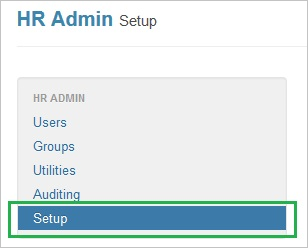
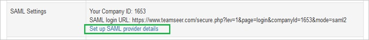
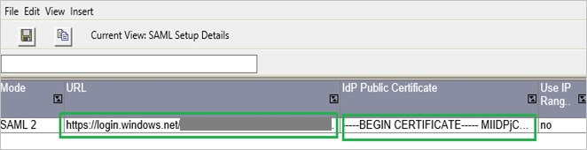
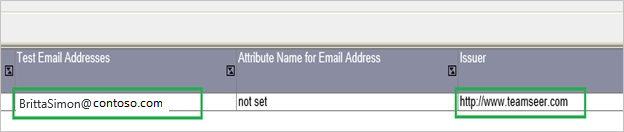

## Prerequisites

To configure Azure AD integration with TeamSeer, you need the following items:

- An Azure AD subscription
- A TeamSeer single-sign on enabled subscription

> **Note:**
> To test the steps in this tutorial, we do not recommend using a production environment.

To test the steps in this tutorial, you should follow these recommendations:

- Do not use your production environment, unless it is necessary.
- If you don't have an Azure AD trial environment, you can get a one-month trial [here](https://azure.microsoft.com/pricing/free-trial/).

### Configuring TeamSeer for single sign-on

1. In a different web browser window, log in to your TeamSeer company site as an administrator.

2. Go to **HR Admin**.
   
    

3. Click **Setup**.
   
    

4. Click **Set up SAML provider details**.
   
    

5. In the SAML provider details section, perform the following steps:
   
       

    a. paste the **Azure AD Single Sign-On Service URL** : %metadata:singleSignOnServiceUrl% value in to the **URL** textbox.
          
    b. Open your **[Downloaded Azure AD Signing Certifcate (Base64 encoded)](%metadata:certificateDownloadBase64Url%)** in notepad, copy the content of it in to your clipboard, and then paste it to the **IdP Public Certificate** textbox.

6. To complete the SAML provider configuration, perform the following steps:
    
     

    a. In the **Test Email Addresses**, type the test user’s email address. 
  
    b. paste the **SAML Entity ID** value in to the **Issuer** textbox. 
  
    c. Click **Save**.

## Quick Reference

* **Azure AD Single Sign-On Service URL** : %metadata:singleSignOnServiceUrl%

* **[Download Azure AD Signing Certifcate (Base64 encoded)](%metadata:certificateDownloadBase64Url%)**

## Additional Resources

* [How to integrate TeamSeer with Azure Active Directory](https://docs.microsoft.com/azure/active-directory/active-directory-saas-teamseer-tutorial)
