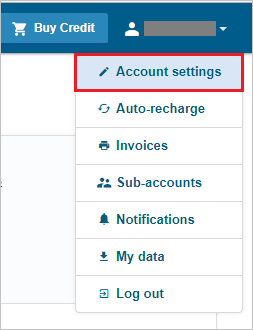
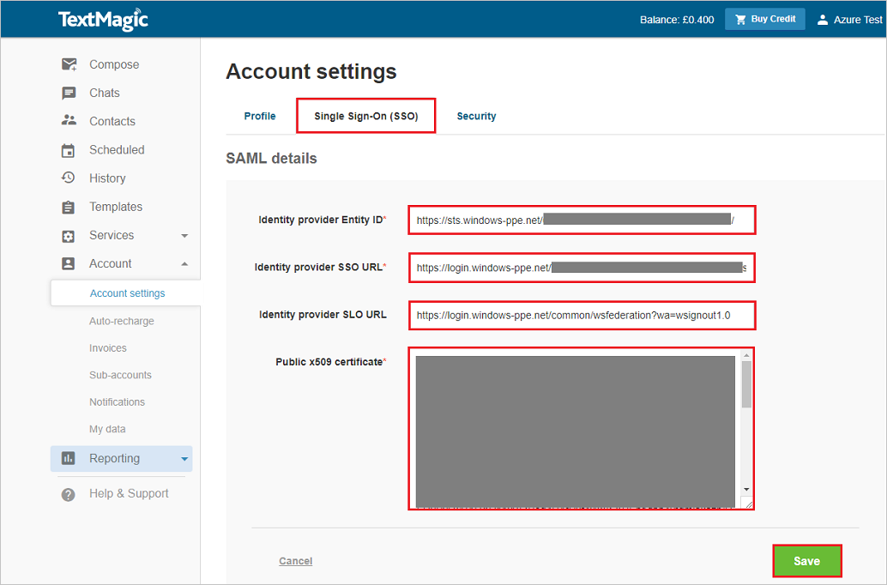

## Prerequisites

To configure Azure AD integration with TextMagic, you need the following items:

- An Azure AD subscription
- A TextMagic single sign-on enabled subscription

> **Note:**
> To test the steps in this tutorial, we do not recommend using a production environment.

To test the steps in this tutorial, you should follow these recommendations:

- Do not use your production environment, unless it is necessary.
- If you don't have an Azure AD trial environment, you can [get a one-month trial](https://azure.microsoft.com/pricing/free-trial/).

### Configuring TextMagic for single sign-on

1. In a different web browser window, log in to your TextMagic company site as an administrator.

2. Select **Account settings** under the username.

	 
3. Click on the TAB  **Single Sign-On (SSO)** and fill in the following fields:  
	
	

	a. In **Identity provider Entity ID:** textbox, paste the value of **Azure AD SAML Entity ID** : %metadata:IssuerUri%, which you have copied from Azure portal.

	b. In **Identity provider SSO URL:** textbox, paste the value of ***Azure AD Single Sign-On Service URL** : %metadata:singleSignOnServiceUrl%, which you have copied from Azure portal.

	c. In **Identity provider SLO URL:** textbox, paste the value of **Azure AD Sign Out URL** : %metadata:singleSignOutServiceUrl%, which you have copied from Azure portal.

	d. Open your **[Downloaded Azure AD Signing Certifcate (Base64 encoded)](%metadata:certificateDownloadBase64Url%)** in notepad downloaded from Azure portal, copy the content of it into your clipboard, and then paste it to the **Public x509 certificate:** textbox.

	e. Click **Save**.

## Quick Reference

* **Azure AD Single Sign-On Service URL** : %metadata:singleSignOnServiceUrl%

* **Azure AD Sign Out URL** : %metadata:singleSignOutServiceUrl%

* **Azure AD SAML Entity ID** : %metadata:IssuerUri%

* **[Download Azure AD Signing Certifcate (Base64 encoded)](%metadata:certificateDownloadBase64Url%)**

## Additional Resources

* [How to integrate TextMagic with Azure Active Directory](https://docs.microsoft.com/azure/active-directory/active-directory-saas-textmagic-tutorial)
