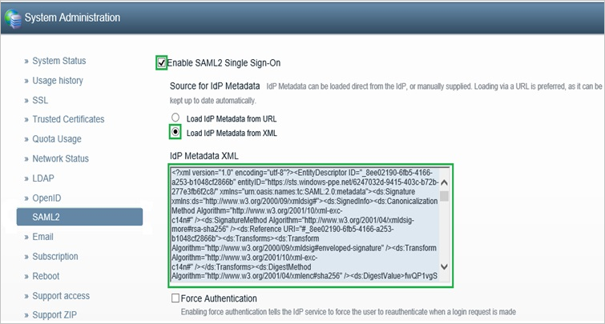

## Prerequisites

To configure Azure AD integration with ThirdLight, you need the following items:

- An Azure AD subscription
- A ThirdLight single-sign on enabled subscription

> **Note**
> To test the steps in this tutorial, we do not recommend using a production environment.

To test the steps in this tutorial, you should follow these recommendations:

- Do not use your production environment, unless it is necessary.
- If you don't have an Azure AD trial environment, you can get a one-month trial [here](https://azure.microsoft.com/pricing/free-trial/).

### Configuring ThirdLight for single sign-on

1. In a different web browser window, log in to your ThirdLight company site as an administrator.

2. Go to **Configuration \> System Administration**, and then click **SAML2**.
   
    

3. In the SAML2 configuration section, perform the following steps:
   
       

	 a. Select **Enable SAML2 Single Sign-On**.
 
	 b. As **Source for IdP Metadata**, select **Load IdP Metadata from XML**.
 
	 c. Open the **[Download SAML Metadata file](%metadata:metadataDownloadUrl%)**, copy the content, and then paste it
     into the **IdP Metadata XML** textbox. 
	 
     d. Click **Save SAML2 settings**.

## Quick Reference

* **[Download SAML Metadata file](%metadata:metadataDownloadUrl%)**

## Additional Resources

* [How to integrate ThirdLight with Azure Active Directory](active-directory-saas-thirdLight-tutorial.md)

