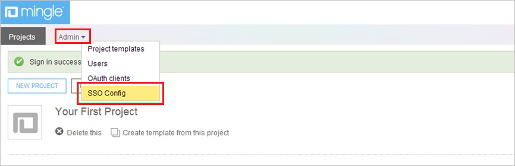
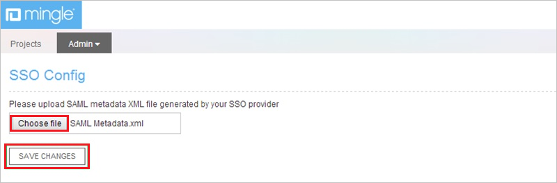

## Prerequisites

To configure Azure AD integration with Thoughtworks Mingle, you need the following items:

- An Azure AD subscription
- A Thoughtworks Mingle single sign-on enabled subscription

> **Note:**
> To test the steps in this tutorial, we do not recommend using a production environment.

To test the steps in this tutorial, you should follow these recommendations:

- Do not use your production environment, unless it is necessary.
- If you don't have an Azure AD trial environment, you can get a one-month trial [here](https://azure.microsoft.com/pricing/free-trial/).

### Configuring Thoughtworks Mingle for single sign-on

1. Log in to your **Thoughtworks Mingle** company site as administrator.

2. Click the **Admin** tab, and then, click **SSO Config**.
   
    

3. In the **SSO Config** section, perform the following steps:
   
    
    
    a. To upload the **[Downloaded SAML Metadata file](%metadata:metadataDownloadUrl%)**, click **Choose file**. 

    b. Click **Save Changes**.

## Quick Reference

* **[Download SAML Metadata file](%metadata:metadataDownloadUrl%)**

## Additional Resources

* [How to integrate Thoughtworks Mingle with Azure Active Directory](https://docs.microsoft.com/azure/active-directory/active-directory-saas-thoughtworks-mingle-tutorial)
