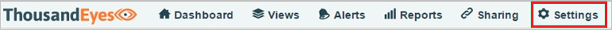
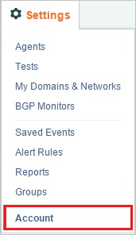
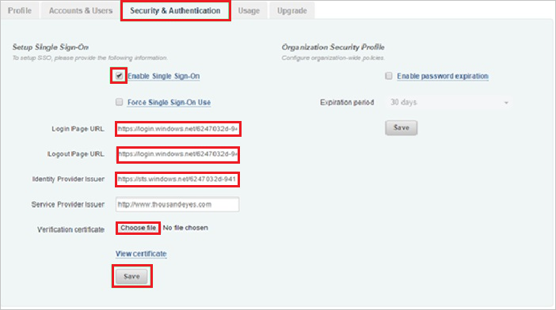

## Prerequisites

To configure Azure AD integration with ThousandEyes, you need the following items:

- An Azure AD subscription
- A ThousandEyes single sign-on enabled subscription

> **Note:**
> To test the steps in this tutorial, we do not recommend using a production environment.

To test the steps in this tutorial, you should follow these recommendations:

- Do not use your production environment, unless it is necessary.
- If you don't have an Azure AD trial environment, you can get a one-month trial [here](https://azure.microsoft.com/pricing/free-trial/).

### Configuring ThousandEyes for single sign-on

1. In a different web browser window, sign on to your **ThousandEyes** company site as an administrator.

2. In the menu on the top, click **Settings**.
   
    

3. Click **Account**
   
    

4. Click the **Security & Authentication** tab.
   
    

5. In the **Setup Single Sign-On** section, perform the following steps:
   
    
  
    a. Select **Enable Single Sign-On**.
  
    b. In **Login Page URL** textbox, enter **Azure AD Single Sign-On Service URL** : %metadata:singleSignOnServiceUrl%.
  
    c. In **Logout Page URL** textbox, enter **Azure AD Sign Out URL** : %metadata:singleSignOutServiceUrl%.
  
    d. **Identity Provider Issuer** textbox, enter **Azure AD SAML Entity ID** : %metadata:IssuerUri%.
  
    e. In **Verification Certificate**, click **Choose file**, and then upload the [certificate](%metadata:certificateDownloadBase64Url%) you have downloaded from Azure portal.
  
    f. Click **Save**.

## Quick Reference

* **Azure AD Single Sign-On Service URL** : %metadata:singleSignOnServiceUrl%

* **Azure AD Sign Out URL** : %metadata:singleSignOutServiceUrl%

* **Azure AD SAML Entity ID** : %metadata:IssuerUri%

* **[Download Azure AD Signing Certifcate (Base64 encoded)](%metadata:certificateDownloadBase64Url%)**

## Additional Resources

* [How to integrate ThousandEyes with Azure Active Directory](https://docs.microsoft.com/azure/active-directory/active-directory-saas-thousandeyes-tutorial)
