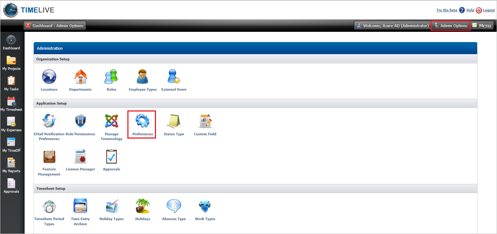
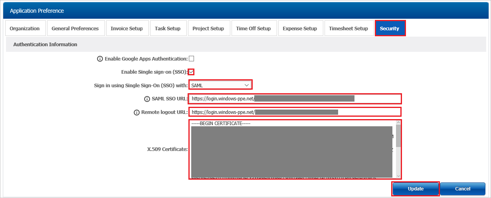

## Prerequisites

To configure Azure AD integration with TimeLive, you need the following items:

- An Azure AD subscription
- A TimeLive single sign-on enabled subscription

> **Note:**
> To test the steps in this tutorial, we do not recommend using a production environment.

To test the steps in this tutorial, you should follow these recommendations:

- Do not use your production environment, unless it is necessary.
- If you don't have an Azure AD trial environment, you can [get a one-month trial](https://azure.microsoft.com/pricing/free-trial/).

### Configuring TimeLive for single sign-on

1. In a different web browser window, log in to your TimeLive company site as an administrator.

2. Select **Preferences** under **Admin Options**.

	

3. In the **Application Preference** section, perform the following steps:
	
	

	a. Select **Security** tab.

	b. Check **Enable Single Sign On (SSO)** checkbox.

	c. Select **SAML** from the drop down menu with heading **Sign in using Single Sign-On (SSO) with**.

	d. In the **SAML SSO URL**, Paste **Azure AD Single Sign-On Service URL** : %metadata:singleSignOnServiceUrl% value which you have copied form the Azure portal.

	e. In the **Remote logout URL**, Paste **Azure AD Sign Out URL** : %metadata:singleSignOutServiceUrl% value which you have copied form the Azure portal.

	f. Open the **[Downloaded Azure AD Signing Certifcate (Base64 encoded)](%metadata:certificateDownloadBase64Url%)** from Azure portal in Notepad, copy the content, and then paste it into the **X.509 Certificate** textbox.

	g. Click **Update**.

## Quick Reference

* **Azure AD Single Sign-On Service URL** : %metadata:singleSignOnServiceUrl%

* **Azure AD Sign Out URL** : %metadata:singleSignOutServiceUrl%

* **[Download Azure AD Signing Certifcate (Base64 encoded)](%metadata:certificateDownloadBase64Url%)**

## Additional Resources

* [How to integrate TimeLive with Azure Active Directory](https://docs.microsoft.com/azure/active-directory/active-directory-saas-timelive-tutorial)
