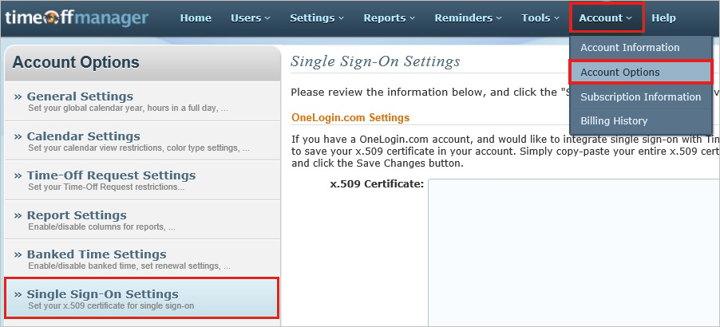
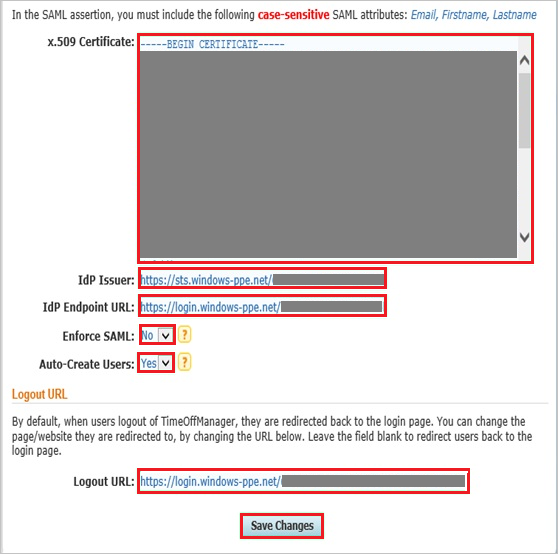

## Prerequisites

To configure Azure AD integration with TimeOffManager, you need the following items:

- An Azure AD subscription
- A TimeOffManager single sign-on enabled subscription

> **Note:**
> To test the steps in this tutorial, we do not recommend using a production environment.

To test the steps in this tutorial, you should follow these recommendations:

- Do not use your production environment, unless it is necessary.
- If you don't have an Azure AD trial environment, you can [get a one-month trial](https://azure.microsoft.com/pricing/free-trial/).

### Configuring TimeOffManager for single sign-on

1. In a different web browser window, log into your TimeOffManager company site as an administrator.

2. Go to **Account \> Account Options \> Single Sign-On Settings**.
   
   
3. In the **Single Sign-On Settings** section, perform the following steps:
   
   
   
   a. Open your **[Downloaded Azure AD Signing Certificate (Base64 encoded)](%metadata:certificateDownloadBase64Url%)** in notepad, copy the content of it into your clipboard, and then paste the entire Certificate into **X.509 Certificate** textbox.
   
   b. In **Idp Issuer** textbox, paste the value of **Azure AD SAML Entity ID** : %metadata:IssuerUri% which you have copied from Azure portal.
   
   c. In **IdP Endpoint URL** textbox, paste the value of **Azure AD Single Sign-On Service URL** : %metadata:singleSignOnServiceUrl% which you have copied from Azure portal.
   
   d. As **Enforce SAML**, select **No**.
   
   e. As **Auto-Create Users**, select **Yes**.
   
   f. In **Logout URL** textbox, paste the value of **Azure AD Sign Out URL** : %metadata:singleSignOutServiceUrl% which you have copied from Azure portal.
   
   g. click **Save Changes**.

## Quick Reference

* **Azure AD Single Sign-On Service URL** : %metadata:singleSignOnServiceUrl%

* **Azure AD Sign Out URL** : %metadata:singleSignOutServiceUrl%

* **Azure AD SAML Entity ID** : %metadata:IssuerUri%

* **[Download Azure AD Signing Certificate (Base64 encoded)](%metadata:certificateDownloadBase64Url%)**

## Additional Resources

* [How to integrate TimeOffManager with Azure Active Directory](https://docs.microsoft.com/azure/active-directory/active-directory-saas-timeoffmanager-tutorial)
