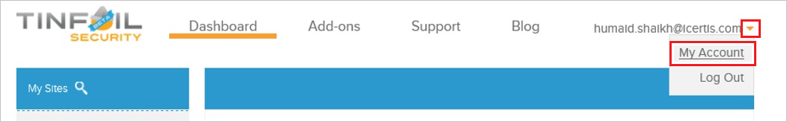
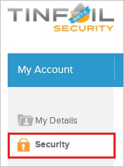
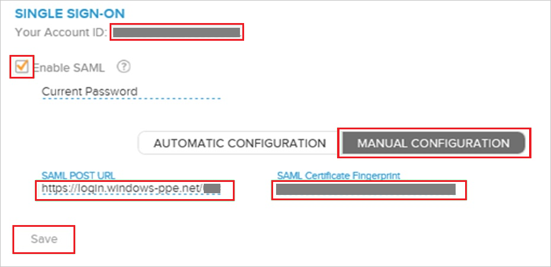

## Prerequisites

To configure Azure AD integration with TINFOIL SECURITY, you need the following items:

- An Azure AD subscription
- A TINFOIL SECURITY single sign-on enabled subscription

> **Note:**
> To test the steps in this tutorial, we do not recommend using a production environment.

To test the steps in this tutorial, you should follow these recommendations:

- Do not use your production environment, unless it is necessary.
- If you don't have an Azure AD trial environment, you can get a one-month trial [here](https://azure.microsoft.com/pricing/free-trial/).

### Configuring TINFOIL SECURITY for single sign-on

1. In a different web browser window, log into your TINFOIL SECURITY company site as an administrator.

2. In the toolbar on the top, click **My Account**.
   
    

3. Click **Security**.
   
    

4. On the **Single Sign-On** configuration page, perform the following steps:
   
    
   
    a. Select **Enable SAML**.
   
    b. Click **Manual Configuration**.
   
    c. In **SAML Post URL** textbox, paste the value of **Azure AD Single Sign-On Service URL** : %metadata:singleSignOnServiceUrl% which you have copied from Azure portal
   
    d. In **SAML Certificate Fingerprint** textbox, paste the value of **Thumbprint** which you have copied from **SAML Signing Certificate** section.
  
    e. Copy **Your Account ID** value and paste the value in **Attribute Value** textbox under **Add Attribute** section in Azure portal.
   
    f. Click **Save**.

## Quick Reference

* **Azure AD Single Sign-On Service URL** : %metadata:singleSignOnServiceUrl%

* **[Download Azure AD Signing Certifcate](%metadata:CertificateDownloadRawUrl%)**

## Additional Resources

* [How to integrate TINFOIL SECURITY with Azure Active Directory](https://docs.microsoft.com/azure/active-directory/active-directory-saas-tinfoil-security-tutorial)
