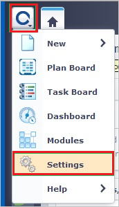
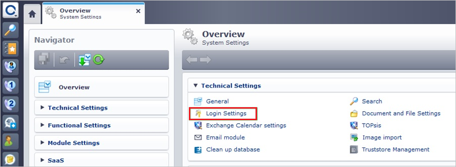
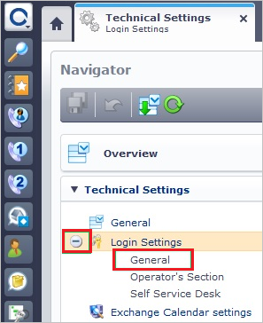
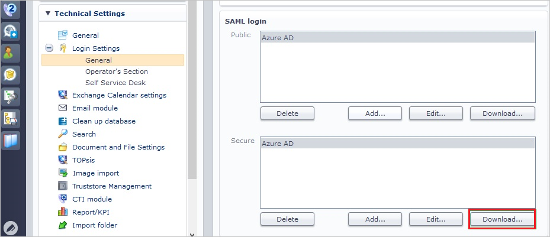
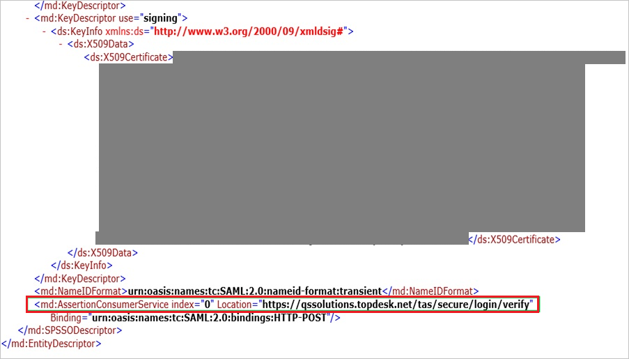
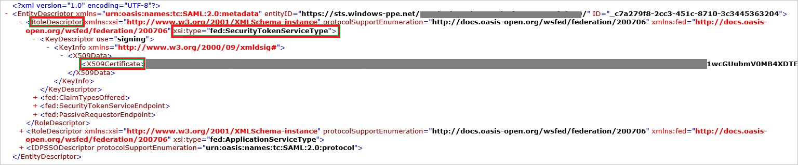
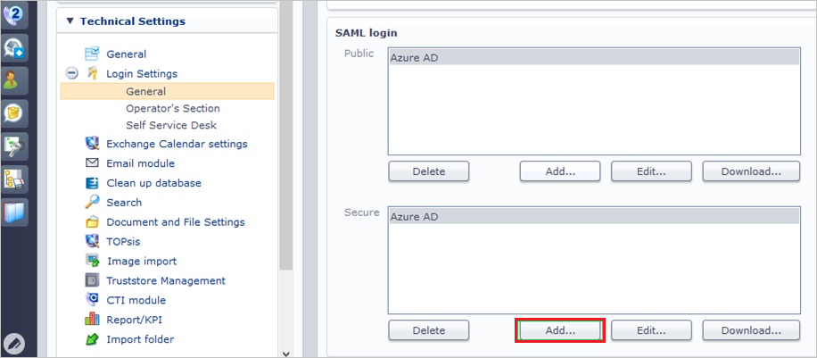
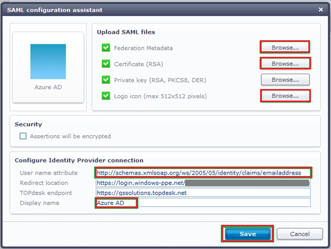

## Prerequisites

To configure Azure AD integration with TOPdesk - Secure, you need the following items:

- An Azure AD subscription
- A TOPdesk - Secure single sign-on enabled subscription

> **Note:**
> To test the steps in this tutorial, we do not recommend using a production environment.

To test the steps in this tutorial, you should follow these recommendations:

- Do not use your production environment, unless it is necessary.
- If you don't have an Azure AD trial environment, you can [get a one-month trial](https://azure.microsoft.com/pricing/free-trial/).

### Configuring TOPdesk - Secure for single sign-on

1. Sign on to your **TOPdesk - Secure** company site as an administrator.

2. In the **TOPdesk** menu, click **Settings**.

	

3. Click **Login Settings**.

	

4. Expand the **Login Settings** menu, and then click **General**.

	

5. In the **Secure** section of the **SAML login** configuration section, perform the following steps:

	
   
    a. Click **Download** to download the public metadata file, and then save it locally on your computer.
   
    b. Open the metadata file, and then locate the **AssertionConsumerService** node.
    
    
   
    c. Copy the **AssertionConsumerService** value, paste this value in the Reply URL textbox in **TOPdesk - Secure Domain and URLs** section.

6. To create a certificate file, perform the following steps:
    
    
    
    a. Open the downloaded metadata file from Azure portal.

    b. Expand the **RoleDescriptor** node that has a **xsi:type** of **fed:ApplicationServiceType**.

    c. Copy the value of the **X509Certificate** node.

    d. Save the copied **X509Certificate** value locally on your computer in a file.

7. In the **Public** section, click **Add**.
    
    

8. On the **SAML configuration assistant** dialog page, perform the following steps:
    
    
    
    a. To upload your downloaded metadata file from Azure portal, under **Federation Metadata**, click **Browse**.

    b. To upload your certificate file, under **Certificate (RSA)**, click **Browse**.

    c. To upload the logo file you got from the TOPdesk support team, under **Logo icon**, click **Browse**.

    d. In the **User name attribute** textbox, type `http://schemas.xmlsoap.org/ws/2005/05/identity/claims/emailaddress`.

    e. In the **Display name** textbox, type a name for your configuration.

    f. Click **Save**.

## Quick Reference

* **[Download SAML Metadata file](%metadata:metadataDownloadUrl%)**

## Additional Resources

* [How to integrate TOPdesk - Secure with Azure Active Directory](https://docs.microsoft.com/azure/active-directory/active-directory-saas-topdesk-secure-tutorial)
