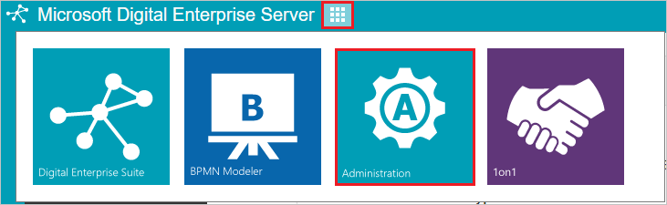
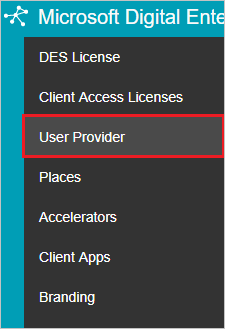
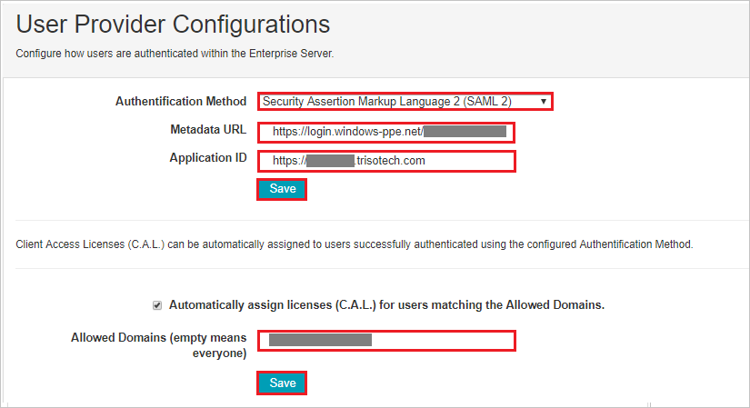

## Prerequisites

To configure Azure AD integration with Trisotech Digital Enterprise Server, you need the following items:

- An Azure AD subscription
- A Trisotech Digital Enterprise Server single sign-on enabled subscription

> **Note:**
> To test the steps in this tutorial, we do not recommend using a production environment.

To test the steps in this tutorial, you should follow these recommendations:

- Do not use your production environment, unless it is necessary.
- If you don't have an Azure AD trial environment, you can [get a one-month trial](https://azure.microsoft.com/pricing/free-trial/).

### Configuring Trisotech Digital Enterprise Server for single sign-on

1. In a different web browser window, log in to your Trisotech Digital Enterprise Server Configuration company site as an administrator.

2. Click on the **Menu icon** and then select **Administration**.

	

3. Select **User Provider**.

	

4. In the **User Provider Configurations** section, perform the following steps:

	

	a. Select **Secured Assertion Markup Language 2 (SAML 2)** from the dropdown in the **Authentication Method**.

	b. In the **Metadata URL** textbox, paste the **Metadata URL** value, which you have copied form the Azure portal.

	c. In the **Application ID** textbox, enter the URL using the following pattern: `https://<companyname>.trisotech.com`.

	d. Click **Save**

	e. Enter the domain name in the **Allowed Domains (empty means everyone)** textbox, it automatically assigns licenses for users matching the Allowed Domains

	f. Click **Save**

## Quick Reference

* **[Download Azure AD Signing Certifcate](%metadata:CertificateDownloadRawUrl%)**

## Additional Resources

* [How to integrate Trisotech Digital Enterprise Server with Azure Active Directory](https://docs.microsoft.com/en-us/azure/active-directory/active-directory-saas-trisotechdigitalenterpriseserver-tutorial)
