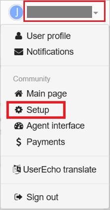
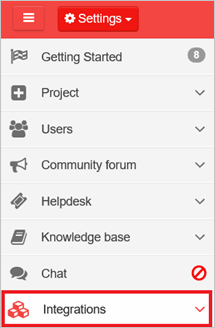
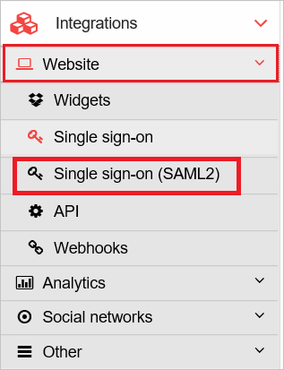
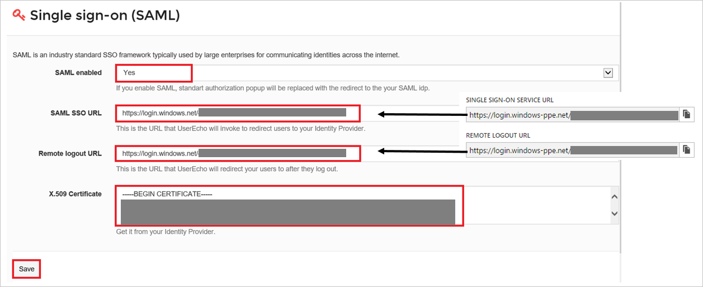

## Prerequisites

To configure Azure AD integration with UserEcho, you need the following items:

- An Azure AD subscription
- A UserEcho single sign-on enabled subscription

> **Note:**
> To test the steps in this tutorial, we do not recommend using a production environment.

To test the steps in this tutorial, you should follow these recommendations:

- Do not use your production environment, unless it is necessary.
- If you don't have an Azure AD trial environment, you can get a one-month trial here: [trail offer](https://azure.microsoft.com/pricing/free-trial/).

### Configuring UserEcho for single sign-on

1. In another browser window, sign on to your UserEcho company site as an administrator.

2. In the toolbar on the top, click your user name to expand the menu, and then click **Setup**.
   
     

3. Click **Integrations**.
   
     

4. Click **Website**, and then click **Single sign-on (SAML2)**.
   
     

5. On the **Single sign-on (SAML)** page, perform the following steps:
   
    
	
	a. As **SAML-enabled**, select **Yes**.
	
	b. Paste **Azure AD Single Sign-On Service URL** : %metadata:singleSignOnServiceUrl%, which you have copied from the Azure portal into the **SAML SSO URL** textbox.
	
	c. Paste **Azure AD Sign Out URL** : %metadata:singleSignOutServiceUrl%, which you have copied from the Azure portal into the **Remote logoout URL** textbox.
	
	d. Open your **[Downloaded Azure AD Signing Certifcate (Base64 encoded)](%metadata:certificateDownloadBase64Url%)** in Notepad, copy the content, and then paste it into the **X.509 Certificate** textbox.
	
	e. Click **Save**.

## Quick Reference

* **Azure AD Single Sign-On Service URL** : %metadata:singleSignOnServiceUrl%

* **Azure AD Sign Out URL** : %metadata:singleSignOutServiceUrl%

* **[Download Azure AD Signing Certifcate (Base64 encoded)](%metadata:certificateDownloadBase64Url%)**

## Additional Resources

* [How to integrate UserEcho with Azure Active Directory](https://docs.microsoft.com/azure/active-directory/active-directory-saas-userecho-tutorial)
