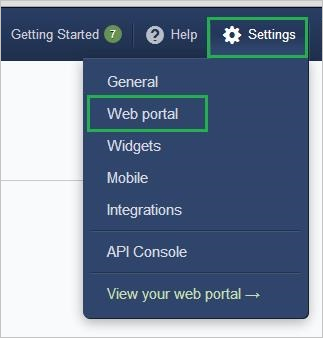
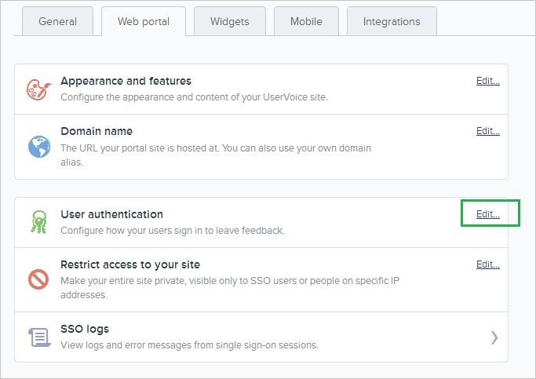
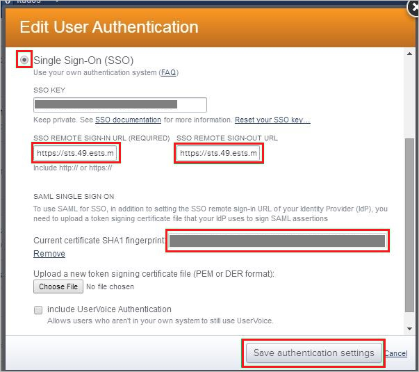

## Prerequisites

To configure Azure AD integration with UserVoice, you need the following items:

- An Azure AD subscription
- A UserVoice single sign-on enabled subscription

> **Note:**
> To test the steps in this tutorial, we do not recommend using a production environment.

To test the steps in this tutorial, you should follow these recommendations:

- Do not use your production environment, unless it is necessary.
- If you don't have an Azure AD trial environment, you can get a one-month trial here: [trail offer](https://azure.microsoft.com/pricing/free-trial/).

### Configuring UserVoice for single sign-on

1. In a different web browser window, log in to your UserVoice company site as an administrator.

2. In the toolbar on the top, click **Settings**, and then select **Web portal** from the menu.
   
    

3. On the **Web portal** tab, in the **User authentication** section, click **Edit** to open the **Edit User Authentication** dialog page.
   
    

4. On the **Edit User Authentication** dialog page, perform the following steps:
   
    
   
    a. Click **Single Sign-On (SSO)**.
 
    b. Paste the **Azure AD Single Sign-On Service URL** : %metadata:singleSignOnServiceUrl% value, which you have copied from the Azure portal into the **SSO Remote Sign-In** textbox.

    c. Paste the **Azure AD Sign Out URL** : %metadata:singleSignOutServiceUrl% value, which you have copied from the Azure portal into the **SSO Remote Sign-Out textbox**.
 
    d. Paste the **Thumbprint** value , which you have copied from Azure portal  into the **Current certificate SHA1 fingerprint** textbox.
	
	e. Click **Save authentication settings**.

## Quick Reference

* **Azure AD Single Sign-On Service URL** : %metadata:singleSignOnServiceUrl%

* **Azure AD Sign Out URL** : %metadata:singleSignOutServiceUrl%

* **[Download Azure AD Signing Certifcate](%metadata:CertificateDownloadRawUrl%)**

## Additional Resources

* [How to integrate UserVoice with Azure Active Directory](https://docs.microsoft.com/azure/active-directory/active-directory-saas-uservoice-tutorial)
