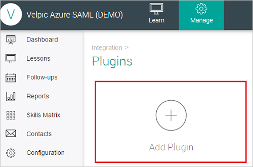

## Prerequisites

To configure Azure AD integration with Velpic SAML, you need the following items:

- An Azure AD subscription
- A Velpic SAML single-sign on enabled subscription

> **Note:**
> To test the steps in this tutorial, we do not recommend using a production environment.

To test the steps in this tutorial, you should follow these recommendations:

- Do not use your production environment, unless it is necessary.
- If you don't have an Azure AD trial environment, you can get a one-month trial [here](https://azure.microsoft.com/pricing/free-trial/).

### Configuring Velpic SAML for single sign-on

1. In a different web browser window, log in to your Velpic SAML company site as an administrator.

2. Click **Manage** tab and go to **Integration** section where you need to click **Plugins** button to create plugin for Sign-In.

	

3. Click the **‘Add plugin’** button.
	
	

4. Click the **SAML** tile in the Add Plugin page.
	
	

5. Enter the name of the new SAML plugin and click the **‘Add’** button.

	

6. Enter the details as follows:

	

	a. In the **Name** textbox, type the name of SAML plugin.

	b. Paste the **Azure AD SAML Entity ID** : %metadata:IssuerUri% value In to the **Issuer URL** textbox.

	c. In the **Provider Metadata Config** upload the Metadata XML file, which you **[Downloaded SAML Metadata file](%metadata:metadataDownloadUrl%)** from Azure portal.

	d. You can also choose to enable SAML just in time provisioning by enabling the **‘Auto create users’** checkbox. If a user doesn’t exist in Velpic and this flag is not enabled, the login from Azure fails. If the flag is enabled the user will automatically be provisioned into Velpic at the time of login. 

	e. Paste the **Azure AD Single Sign-On Service URL** : %metadata:singleSignOnServiceUrl% value in to the **single sign on URL** textbox.
	
	f. Click **Save**.

## Quick Reference

* **Azure AD Single Sign-On Service URL** : %metadata:singleSignOnServiceUrl%

* **Azure AD Sign Out URL** : %metadata:singleSignOutServiceUrl%

* **Azure AD SAML Entity ID** : %metadata:IssuerUri%

* **[Download SAML Metadata file](%metadata:metadataDownloadUrl%)**

## Additional Resources

* [How to integrate Velpic SAML with Azure Active Directory](active-directory-saas-velpicsaml-tutorial.md)
