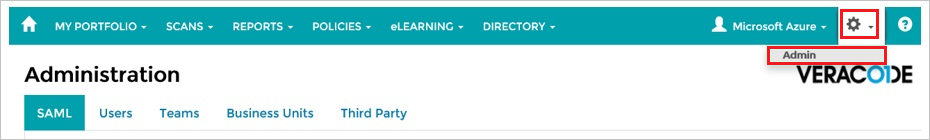
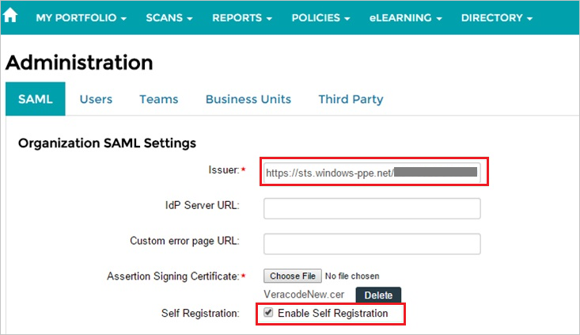
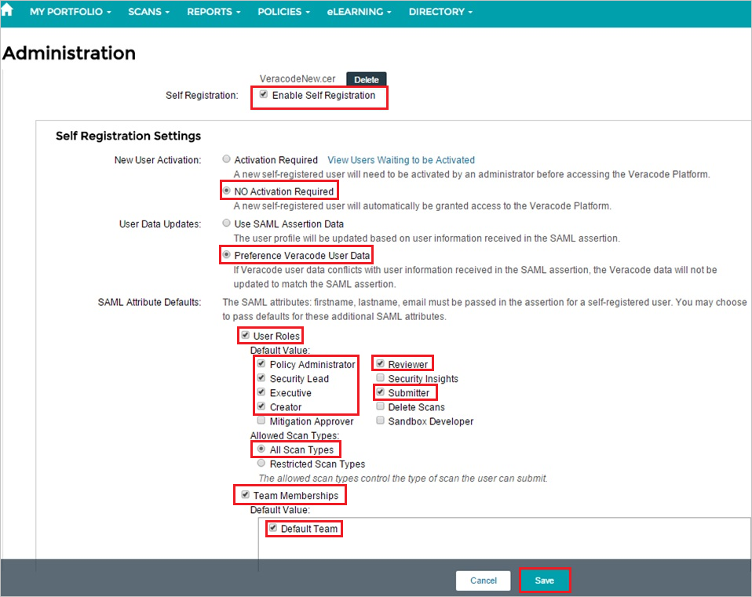

## Prerequisites

To configure Azure AD integration with Veracode, you need the following items:

- An Azure AD subscription
- A Veracode single sign-on enabled subscription

> **Note:**
> To test the steps in this tutorial, we do not recommend using a production environment.

To test the steps in this tutorial, you should follow these recommendations:

- Do not use your production environment, unless it is necessary.
- If you don't have an Azure AD trial environment, you can [get a one-month trial](https://azure.microsoft.com/pricing/free-trial/).

### Configuring Veracode for single sign-on

1. In a different web browser window, log into your Veracode company site as an administrator.

2. In the menu on the top, click **Settings**, and then click **Admin**.
   
    

3. Click the **SAML** tab.

4. In the **Organization SAML Settings** section, perform the following steps:
   
    
   
    a.  In  **Issuer** textbox, paste the value of **Azure AD SAML Entity ID** : %metadata:IssuerUri% which you have copied from Azure portal.
	
    b. To upload your **[Downloaded Azure AD Signing Certificate (Base64 encoded)](%metadata:certificateDownloadBase64Url%)** from Azure portal, click **Choose File**.
   
    c. Select **Enable Self Registration**.

5. In the **Self Registration Settings** section, perform the following steps, and then click **Save**:
   
    
   
    a. As **New User Activation**, select **No Activation Required**.
   
    b. As **User Data Updates**, select **Preference Veracode User Data**.
   
    c. For **SAML Attribute Details**, select the following:
      * **User Roles**
      * **Policy Administrator**
      * **Reviewer**
      * **Security Lead**
      * **Executive**
      * **Submitter**
      * **Creator**
      * **All Scan Types**
      * **Team Memberships**
      * **Default Team**

## Quick Reference

* **Azure AD SAML Entity ID** : %metadata:IssuerUri%

* **[Download Azure AD Signing Certificate (Base64 encoded)](%metadata:certificateDownloadBase64Url%)**

## Additional Resources

* [How to integrate Veracode with Azure Active Directory](https://docs.microsoft.com/azure/active-directory/active-directory-saas-veracode-tutorial)
