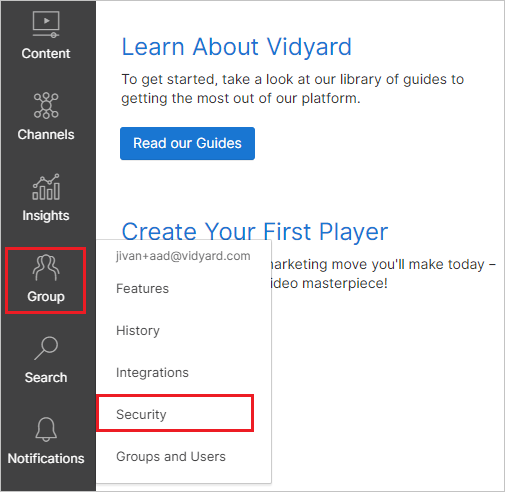
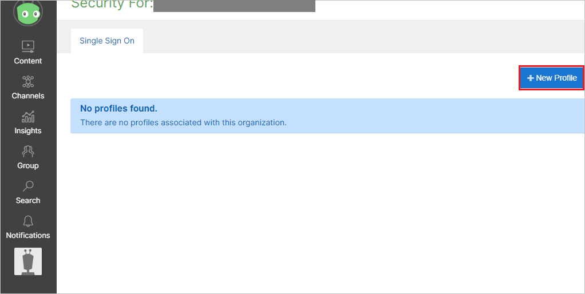
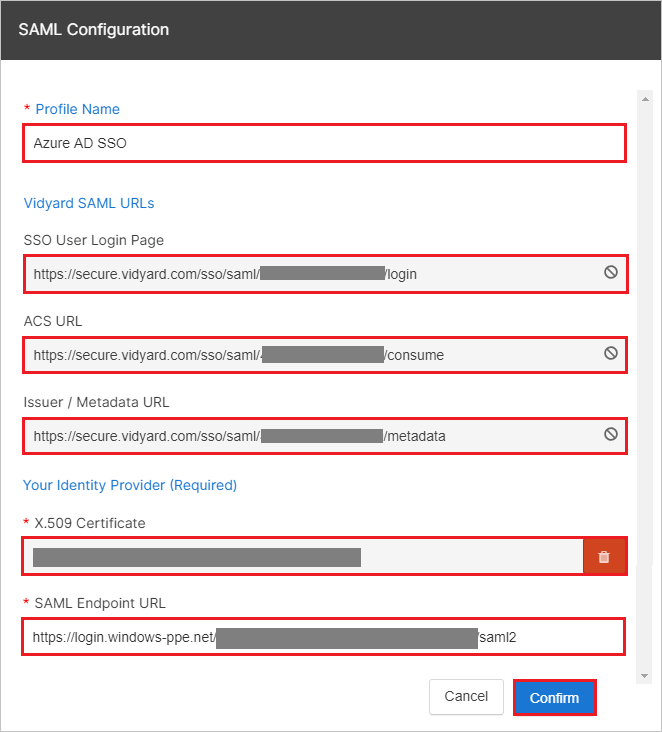
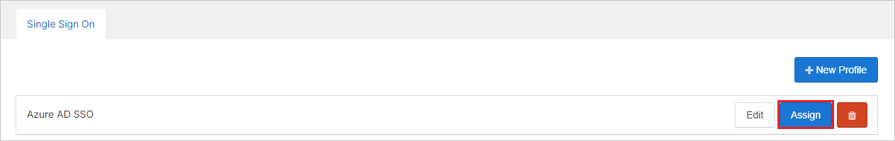
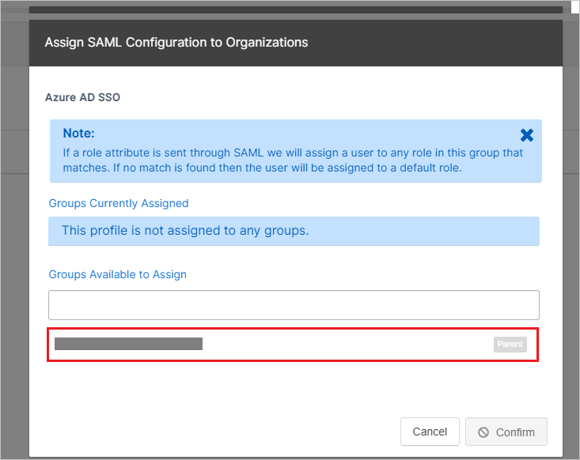
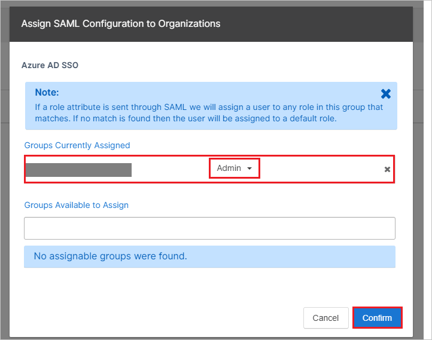

## Prerequisites

To configure Azure AD integration with Vidyard, you need the following items:

- An Azure AD subscription
- A Vidyard single sign-on enabled subscription

> **Note:**
> To test the steps in this tutorial, we do not recommend using a production environment.

To test the steps in this tutorial, you should follow these recommendations:

- Do not use your production environment, unless it is necessary.
- If you don't have an Azure AD trial environment, you can [get a one-month trial](https://azure.microsoft.com/pricing/free-trial/).

### Configuring Vidyard for single sign-on

1. In a different web browser window, log in to your Vidyard Software company site as an administrator.

2. From the Vidyard dashboard, select **Group** > **Security**

	

3. Click **New Profile** tab.

	

4. In the **SAML Configuration** section, perform the following steps:

	

	a. Please enter general profile name in the **Profile Name** textbox.

	b. Copy **SSO User Login Page** value and paste it into **Sign on URL** textbox in **Vidyard Domain and URLs section** on Azure portal.

	c. Copy **ACS URL** value and paste it into **Reply URL** textbox in **Vidyard Domain and URLs section** on Azure portal.

	d. Copy **Issuer/Metadata URL** value and paste it into **Identifier** textbox in **Vidyard Domain and URLs section** on Azure portal.

	e. Open your **[Downloaded Azure AD Signing Certifcate (Base64 encoded)](%metadata:certificateDownloadBase64Url%)** from Azure portal in Notepad and then paste it into the **X.509 Certificate** textbox.

	f. In the **SAML Endpoint URL** textbox, paste the value of **Azure AD Single Sign-On Service URL** : %metadata:singleSignOnServiceUrl% copied from Azure portal.

	g. Click **Confirm**.

5. From the Single Sign On tab, select **Assign** next to an existing profile

	

	> [!NOTE]
	> Once you have created an SSO profile, assign it to any group(s) for which users will require access through Azure. If the user does not exist within the group to which they were assigned, Vidyard will automatically create a user account and assign their role in real-time.

6. Select your organization group, which is visible in the **Groups Available to Assign**.

	

7. You can see the assigned groups under the **Groups Currently Assigned**. Select a role for the group as per your organization and click **Confirm**.

	

	> [!NOTE]
	> For more information, refer [this doc](https://knowledge.vidyard.com/saml-single-sign-on-authentication/saml-based-single-sign-on-sso-in-vidyard).

## Quick Reference

* **Azure AD Single Sign-On Service URL** : %metadata:singleSignOnServiceUrl%

* **[Download Azure AD Signing Certifcate (Base64 encoded)](%metadata:certificateDownloadBase64Url%)**

## Additional Resources

* [How to integrate Vidyard with Azure Active Directory](https://docs.microsoft.com/azure/active-directory/active-directory-saas-vidyard-tutorial)
