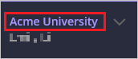
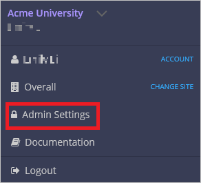
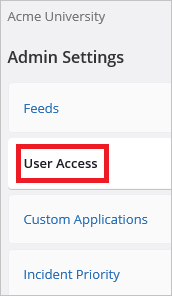
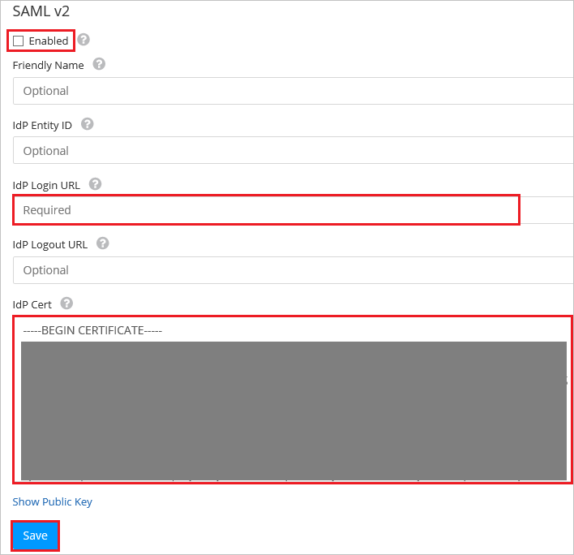

## Prerequisites

To configure Azure AD integration with Voyance, you need the following items:

- An Azure AD subscription
- A Voyance single sign-on enabled subscription

> **Note:**
> To test the steps in this tutorial, we do not recommend using a production environment.

To test the steps in this tutorial, you should follow these recommendations:

- Do not use your production environment, unless it is necessary.
- If you don't have an Azure AD trial environment, you can get a one-month trial [here](https://azure.microsoft.com/pricing/free-trial/).

### Configuring Voyance for single sign-on

1. In a different web browser window, sign-on to your Voyance tenant as an administrator.

2. Go to the top right corner of the navigation bar and click on the drop-down that says "**Acme University**".
	
	 

3. Click "**Admin Settings**".

	

4. Click "**User Access**" tab.

	

5. Click the "**SSO is disabled**" button to configure Azure AD as an IdP using SAML 2.0.

	

6. Go to **SAML v2** section and perform below steps:

	
	
	a. Select **Enabled**.
	
	b. In the **IdP Login URL** textbox, enter **Azure AD Single Sign-On Service URL** : %metadata:singleSignOnServiceUrl%.

	c. Open your downloaded [Base64 encoded certificate](%metadata:certificateDownloadBase64Url%) in notepad, copy the content of it into your clipboard, and then paste it to the **IdP Cert** textbox.
	
	d. Click **Save**.

## Quick Reference

* **Azure AD Single Sign-On Service URL** : %metadata:singleSignOnServiceUrl%

* **[Download Azure AD Signing Certifcate (Base64 encoded)](%metadata:certificateDownloadBase64Url%)**

## Additional Resources

* [How to integrate Voyance with Azure Active Directory](https://docs.microsoft.com/azure/active-directory/active-directory-saas-voyance-tutorial)
